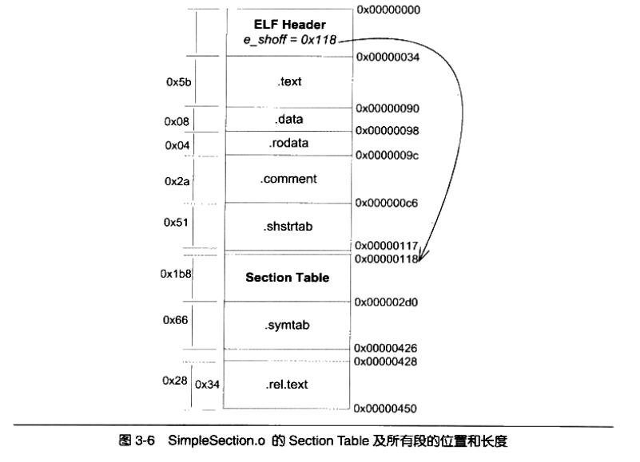
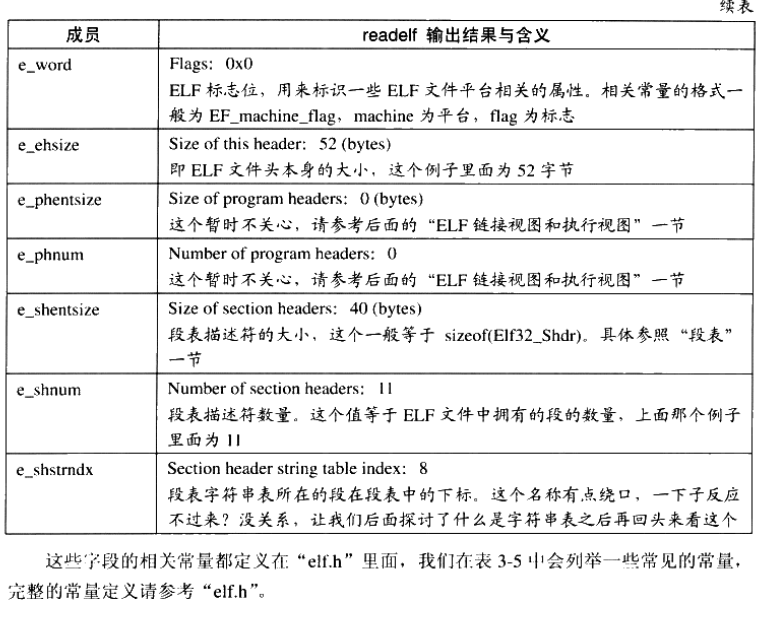
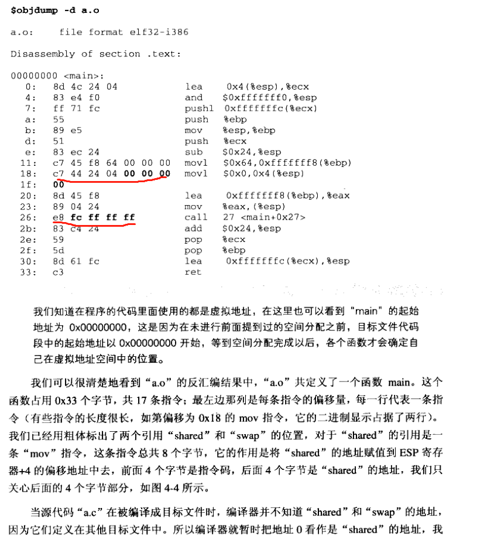

### a示例代码

### ELF格式

####  ELF Header

#### Section Header Table 段表

指令: `readel£ -S`

#### 字符串表 .strtab

#### 符号表 .symtab

指令: `readelf -s`

#### 重定位表 .rel.text  .rel.data

指令 : objdump -r

* 由图1可以看到swap方法是R_X86_64_PLT32 计算法方法为 计算方式未知  https://bbs.pediy.com/thread-246373.htm 感觉不对
  调用方法 (main) addr = 66a  被调用方法(swap) addr = 6c4 addend = -4  offset = 3b
  那么调整 main方法offset为3b(addr(main)+offset)位置的操作数改为 addr(swap)- addend -addr(main) - offset = 1b

* 由图1可以看到share变量是R_X86_64_PC32 计算法方法为
  调用方法 (main) addr = 66a  append = -4  offset = 2e  变量地址addr(share) = 201014
  那么调整 main方法offset为2e (addr(main)+offset)位置的操作数改为 addr(share)- addend -addr(main) - offset = 200978

  

### 链接

#### 静态链接

##### 空间与地址分配

1. 按序叠加(不可取)

   

2. 相似段合并

   

###### 符号地址的确定

##### 符号解析

##### 重定位

### GOT和PLT

 如果一 个目标 模块调用定义在 共享库中的任何函数 ,那么 它就有 自己的 GOT 和 PLT,GOT 是数 据段的 一部分 ,而
PLT 是代码 段的一部分。

### 程序装载

* 符号的优先级

  当一个符号需要被加入全局符号表时，如果相同的符号名已经存在，则后加入的符号被忽略。

  由于存在这种重名符号被直接忽略的问题，当程序使用大量共享对象时应该非常小心符号的重名问题，如果两个符号重名又执行不闻的功能，那么程序运行时可能会将所有该符号名的引用解析到第一个被加入全局符号表的使用该符号名的符号，从而导致程序莫名其妙的错误。

  
  
  

### elf问题

一. 1. c编译出 可重定位目标文件 2. 可重定位文件通过 链接 生成程序 3. 程序运行 .  以上是静态编译链接运行的过程 还有不懂的地方(这其中有个细节符号的重定位如何运作的)正在了解.
二. 动态链接过程(got plt如何赋值) 
三.  程序如何装载进入内存,各个section对应内存哪部分

1. 为什么需要重定向

   可重定位文件引用了外部符号

2. 什么叫与位置无关的代码 PIC导致错误

3. 符号表elf中第几个字段 

4. 为什么需要链接 链接到底干了什么,有什么好处

5. 静态和动态链接  静态链接做什么用

6. 各个段和链接有什么关系

https://github.com/kubo/plthook

elf pdf

http://www.cs.yale.edu/homes/aspnes/pinewiki/attachments/ELF(20)format/ELF_format.pdf

