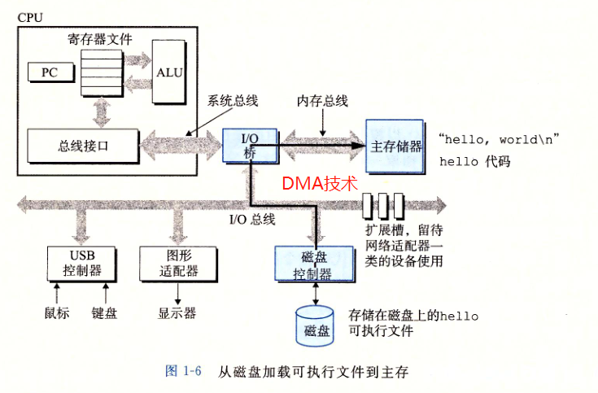
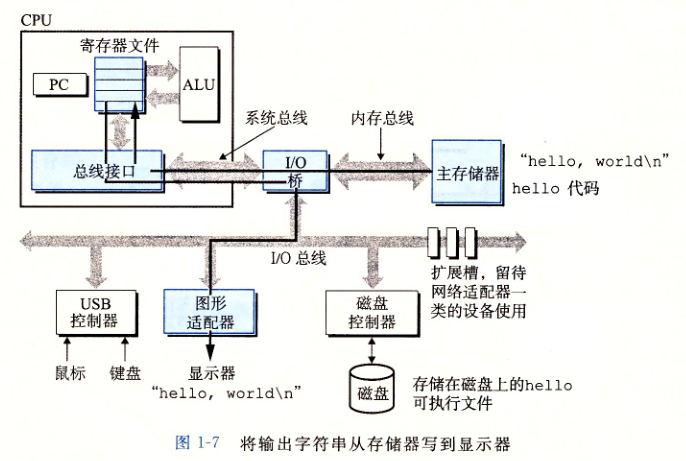
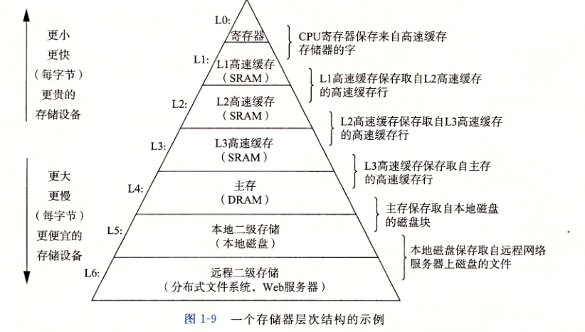
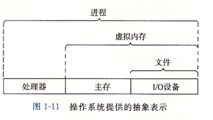
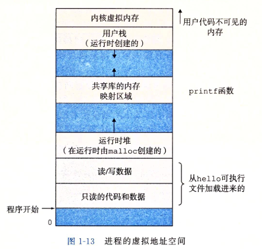

## 第一章 、计算机漫游

### 前言

本书想帮助你了解你在系统上执行hello程序时,系统会发生什么以及为什么会这样

### 1.1  信息就是位+上下文

* 计算机内存和磁盘中存放的数据都是由二进制存储的

  以hello.c来说,源程序实际上是以0,1组成的比特位序列,8个为一组称为字节.

### 1.2  程序被其他程序翻译成不同的格式 (重要)

hello程序通过编译器被转化成一系列 *低级机器语言指令* ,指令以*可执行目标程序*的格式打好包,生成的文件成为*可执行目标文件*.

* 编译过程

  执行命令

  ```shell
  gcc -o hello hello.c
  ```

  

  

  1. 预处理 

     处理 #开头的预处理命令 比如#include #define 等,一般输入文件定义为.i文件

     `gcc -o hello.i -E  hello.c `

  2. 编译

     将程序编译成汇编,一般输入文件定义为.s文件

     `gcc -o hello.s -S hello.i`

  3. 汇编

     翻译成机器语言指令,并把指令打包为*可重定向目标程序*,一般输入文件定义为.o文件

     `gcc -o hello.o -c hello.s`

  4. 链接

     由于*可重定向目标程序*调用了其他*可重定向目标程序*的函数,链接器将其连接生成可执行文件

     `gcc -o hello hello.o`

### 1.3 了解编译系统如何工作是有大益处的

* 程序优化

  了解讲c转化为机器码的过程和结果,知道不同语句生成的机器码,对运行效率的影响

* 理解链接时出现的错误

* 避免安全漏洞

  安全编程的第一部是理解数据和控制信息存储在程序栈上的方式引起的后果,缓冲区栈溢出错误造成安全漏洞

### 1.4 处理器读并结实存储在内存中的指令

 1. 系统硬件组成

    * [总线]([https://baike.baidu.com/item/%E6%80%BB%E7%BA%BF/108823?fr=aladdin](https://baike.baidu.com/item/总线/108823?fr=aladdin))

      贯穿系统的一组电子管.总线负责各个组件间传递*字节块(word)*,字长在32位系统上为4字节,64位为8字节.

      - 数据总线（Data Bus）：在CPU与RAM之间来回传送需要处理或是需要储存的数据。
      - 地址总线（Address Bus）：用来指定在RAM之中储存的数据的地址。地址总线的位数决定了CPU可[直接寻址](https://baike.baidu.com/item/直接寻址)的内存空间大小
      - 控制总线（Control Bus）：将微处理器控制单元的信号，传送到周边设备。
      - 扩展总线（Expansion Bus）：外部设备和计算机主机进行数据通信的总线，例如ISA总线，PCI总线。
      - 局部总线（Local Bus）：取代更高速数据传输的扩展总线。

    * I/O设备

      输入输出设备:鼠标键盘等为输入设备,显示器等为输出设备,用于数据存储的磁盘驱动器,还有其他i/o设备

    * 主存

      就是我们常说的RAM,临时存储设备

    * 处理器

      *解释(执行)*贮存中的指令,处理器的核心是一个大小为一个*字*(word)的存储设备,称为程序计数器,*PC*指向主存中的某一条机器语言指令.执行指令的*简单操作*,然后指向下一条(不一定相邻,可能会有跳转,和java中调用其他方法一样).简单操作围绕着主存,寄存器,算术/逻辑单元(ALU),包括以下操作 

      * 加载 : 从主存复制一个字节或者字到寄存器,覆盖原来的值
      * 存储: 从寄存器复制一个字或者字节到主存
      * 操作: 把若干个寄存器的内存使用ALU进行算术运算,然后把结果存在一个寄存器中
      * 跳转: PC指针跳转到一个目标指令地址

	2. hello程序运行过程

    * 编译过程

      

    * 运行过程

      

### 1.5 高速缓存至关重要

出现原因: cpu从寄存器中读数据比从主存中读取快很多,所以需要一个很快的缓存,即高速缓存

### 1.6 存储设备形成层次结构

 

### 1.7 操作系统管理硬件

hello程序通过系统提供的服务访问键盘,显示器,磁盘,主存.
操作系统两个基本功能:

* 防止硬件被失控应用滥用

* 向应用程序提供简一致的机制来控制复杂的硬件设备,

  文件是对i/o设备的抽象表示 虚拟内存是对主存和磁盘i/o设备的抽象表示,进程则是对处理器,主存和i/o设备的抽象表示



1. 进程

   进程是操作系统对一个正在运行的程序的一种抽象.一个系统可以同时运行多个进程,看似都是独占硬件,实际上是并发运行,即一个进程的指令和另一个进程指令交错执行,这种机制称之为*上下文切换*.
   操作系统保存进程所需的所有状态信息,称之为*上下文*,包括PC,寄存器内容,主存内容.
   在切换上下文的时候,保存当前进程上下文,恢复新进程的上下文.新的进程会从它上次停止的地方开始.进程切换是操作系统内核管理的

2. 线程

   一个进程可包括多个线程,每个线程都运行在进程的上下文中,并共享同样的代码和全局数据.

3. 虚拟内存

   虚拟内存提供让每个进程都独占主存的假象,每个进程看到的内存都一致,如下图

   

   虚拟内存构成:

   * 程序代码和数据

     存储进程代码和数据区的空间,从一个固定地址开始,指定大小不会再变

   * 堆

     malloc数据存放区,紧随这程序代码和数据空间

   * 共享内存

     存放c标准库和数学库的代码和数据的区域,大约在地址空间的中部分

   * 栈

     函数中的局部变量存放位置,在调用函数时增长,返回时减少.在内核虚拟内存之下.

   * 内核虚拟内存

     为内核保留的,不允许应用程序读写内容和调用函数.不虚调用内核来执行

4. 文件

   i/o设备被映射为文件

### 1.8 系统之间利用网络通信


### 1.9 重要主题

1. amdahl定律

   对系统某部分加速时,对系统整体性能影响取决于该部分的重要性和加速度 

2. 并发和并行

   * 线程级并发
   * 指令级并发
   * 单指令,多数据并行

3. 计算机系统中抽象的重要

   * 文件是对i/o设备的抽象
   * 虚拟内存是对程序存储器的抽象
   * 进程是对一个正在运行的程序的抽象
   * 虚拟机是对整个计算机的抽象,包括操作系统 处理器 程序


