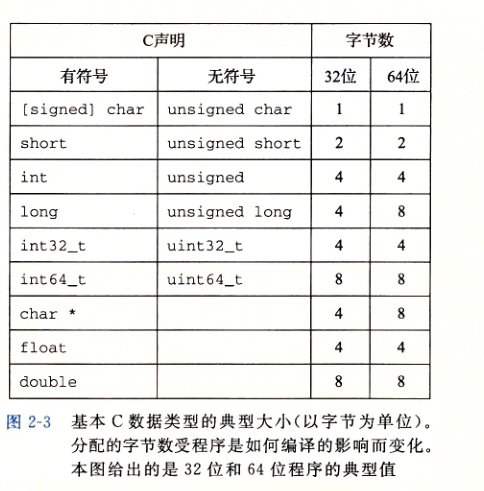
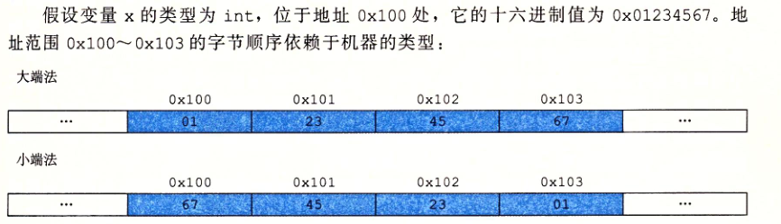
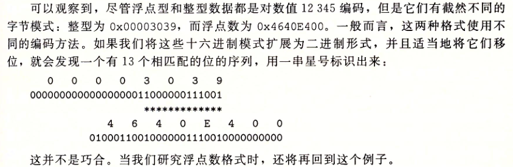
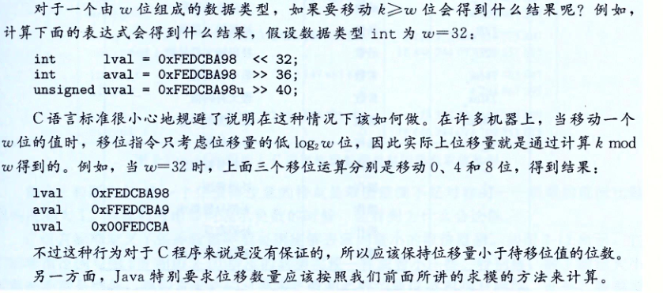
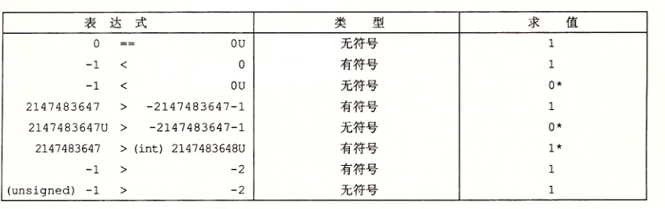
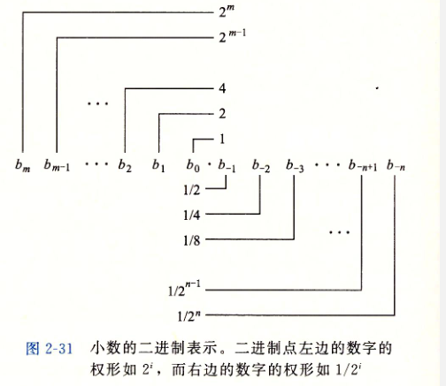

## 第二章、信息的表示和处理

### 2.1 信息存储

内存的每个字节都是由一个唯一的数字来标识，称它为*地址*

1. 一个字节8位组成

2. 字数据大小

   每台计算机都有一个字长（word size）,指明指针数组的标称大小.虚拟地址是以这样一个字来编码的,字长决定重要的系统参数虚拟地址空间的最大大小.32位计算机最大内存4G

   

3. 寻址和字节顺序

   * 大端法

     最高有效字节在前(地址小的位置)

   * 小端法

     最低有效字节在前(地址小的位置)

   

   浮点数编码float十六进制和二进制

   

4. 表示字符串

   c语言中字符串被编码为以一个null(0)字符结尾的字符数组

5. 表示代码

   相同的代码在不同机器上编译,指令编码是不同的.不同的机器类型使用不同的且不兼容的指令和编码方式

6. 布尔代数简介

7. c语言中的位运算

   与 或 非 异或  同或

8. C语言中的逻辑运算

   * 非0都表示trure

   * 逻辑运算法第一个参数能确定表达式结果,那么第二个参数不会求值

9. c语言中的位移运算

   * 逻辑右移
   * 算术右移: 操作数为1 则补1

   c语言标准没有明确规定对于有符号数应该用哪种,实际上所有编译器/机器都对有符号数使用算术右移

   

### 2.2 整数表示

1. 整型数据类型

   char short int long longlong

   负数范围比整的大一

2. 无符号编码

   范围0 - 2^n-1

3. 补码编码

   有符号数的负数在计算机表示的方式是补码

   负数源码->反码(除了符号位全按位)->补码(反码+1)

   正数的反码是本身

4. 有符号和无符号数之间的转化

5. C语言中的有符号数和无符号数

   c语言所有整型数据支持有符号和无符号,默认为有符号,无符号辉添加U或者u例如 12345u 0x123u

   * 有符号和无符号计算时 有符号会隐式转化为无符号数

     

6. 扩展一个数字的位表示

   * 将一个无符号数转化为更大的数只需要在开头加0
   * 将有符号数转化为更大的书按照补码的符号位来补空位

7. 截断数据

   * 截断无符号数

   * 截断补码数值

     有符号数用补码来截取

8. 关于有符号数与符号数的建议

### 2.3 整数运算

1. 无符号加法	

   截断高位

2. 补码加法

   截取高位

3. 补码的非 其实就是有符号数取非

   负数: 直接取反 结果为 -(n+1)

   正数: 直接取反 结果为 -(n+1)

4. 无符号乘法 没有看懂

5. 补码乘法  没有看懂

6. 乘以常数 没有看懂

7. 除以2的幂 没有看懂

8. 关于整数运算的最后思考

### 2.4 浮点数

没有看懂

