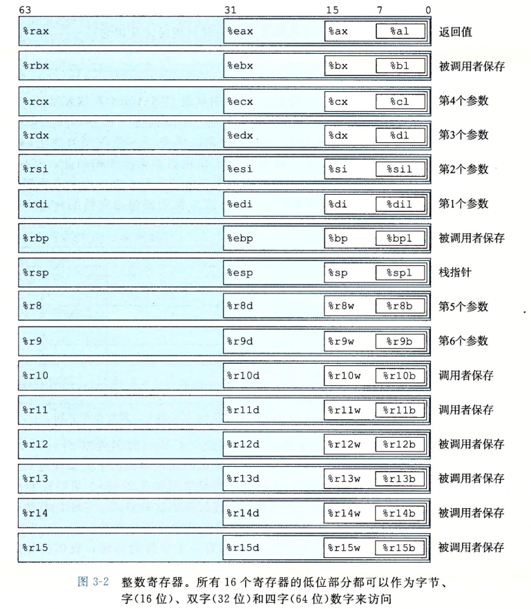
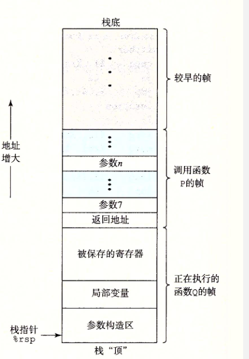
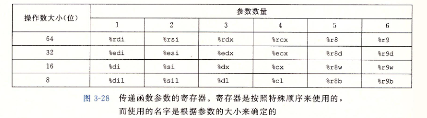
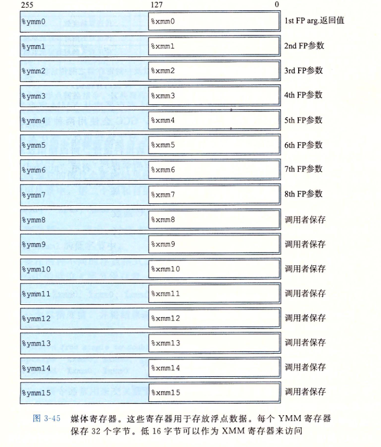

## 第三章 程序在机器上的表现

```c
#include <stdio.h>
long add(long a, long b){
	long * aa = &a;
	long * bb = &b;
	return *aa+*bb;
}

long add1(long *a, long *b){

	return *a+*b;
}
int main(){
	
	long a =0;
	long b=1;
	
	long c = add(a,b);
	
	long d = add1(&a,&b);
	printf("hello %ld %ld",c,d);
	return 0;
}


```


```assembly
	.file	"hello.c"
	.text
	.globl	add
	.type	add, @function
add:
.LFB0:
	.cfi_startproc
	pushq	%rbp # 保存rbp
	.cfi_def_cfa_offset 16
	.cfi_offset 6, -16
	movq	%rsp, %rbp # 将rsp存入rbp中
	.cfi_def_cfa_register 6
	movq	%rdi, -24(%rbp)
	movq	%rsi, -32(%rbp)
	leaq	-24(%rbp), %rax
	movq	%rax, -16(%rbp)
	leaq	-32(%rbp), %rax
	movq	%rax, -8(%rbp)
	movq	-16(%rbp), %rax
	movq	(%rax), %rdx
	movq	-8(%rbp), %rax
	movq	(%rax), %rax
	addq	%rdx, %rax
	popq	%rbp
	.cfi_def_cfa 7, 8
	ret
	.cfi_endproc
.LFE0:
	.size	add, .-add
	.globl	add1
	.type	add1, @function
add1:
.LFB1:
	.cfi_startproc
	pushq	%rbp
	.cfi_def_cfa_offset 16
	.cfi_offset 6, -16
	movq	%rsp, %rbp
	.cfi_def_cfa_register 6
	movq	%rdi, -8(%rbp)
	movq	%rsi, -16(%rbp)
	movq	-8(%rbp), %rax
	movq	(%rax), %rdx
	movq	-16(%rbp), %rax
	movq	(%rax), %rax
	addq	%rdx, %rax
	popq	%rbp
	.cfi_def_cfa 7, 8
	ret
	.cfi_endproc
.LFE1:
	.size	add1, .-add1
	.section	.rodata
.LC0:
	.string	"hello %ld %ld"
	.text
	.globl	main
	.type	main, @function
main:
.LFB2:
	.cfi_startproc
	pushq	%rbp
	.cfi_def_cfa_offset 16
	.cfi_offset 6, -16
	movq	%rsp, %rbp
	.cfi_def_cfa_register 6
	subq	$48, %rsp
	movq	%fs:40, %rax
	movq	%rax, -8(%rbp)
	xorl	%eax, %eax
	movq	$0, -40(%rbp)
	movq	$1, -32(%rbp)
	movq	-32(%rbp), %rdx
	movq	-40(%rbp), %rax
	movq	%rdx, %rsi
	movq	%rax, %rdi
	call	add
	movq	%rax, -24(%rbp)
	leaq	-32(%rbp), %rdx
	leaq	-40(%rbp), %rax
	movq	%rdx, %rsi
	movq	%rax, %rdi
	call	add1
	movq	%rax, -16(%rbp)
	movq	-16(%rbp), %rdx
	movq	-24(%rbp), %rax
	movq	%rax, %rsi
	leaq	.LC0(%rip), %rdi
	movl	$0, %eax
	call	printf@PLT
	movl	$0, %eax
	movq	-8(%rbp), %rcx
	xorq	%fs:40, %rcx
	je	.L7
	call	__stack_chk_fail@PLT
.L7:
	leave
	.cfi_def_cfa 7, 8
	ret
	.cfi_endproc
.LFE2:
	.size	main, .-main
	.ident	"GCC: (Ubuntu 7.5.0-3ubuntu1~18.04) 7.5.0"
	.section	.note.GNU-stack,"",@progbits

```

​	参考blog : [深入浅出GNU X86-64 汇编](https://blog.csdn.net/pro_technician/article/details/78173777)

1. 生成指令: `gcc -S hello.c -o hello.s` 
2. 以`.`开头的的都是指导汇编器和链接器工作的伪指令,通常可以忽略.

* 问题:
  1. 为什么申请48个字节内存却只用32个
  2. -16(%rbp)什么意思



### 程序运行过程


 1. 运行时栈

    

 2. 函数调用: callq retq 

 3. 参数传递: 1-6个参数用寄存器传递,多的用栈

    

4. 局部变量存储

   局部变量一下情况必须放内存中:

   * 寄存器不足够存放本地变量
   * 对一个局部变量使用地址运算符,必须得有地址
   * 某些局部变量是数组

 5. 寄存器中的局部变量
    寄存器%rbx,%rbp和%r12-%r15被划分为调用者保存寄存器

### 数组分配 结构体分配 联合体分配


### 数据对齐

### 浮点数操作



### 字节对齐

- 1) 结构体变量的首地址能够被其最宽基本类型成员的大小所整除；
- 2) 结构体每个成员相对于结构体首地址的偏移量（offset）都是成员大小的整数倍，如有需要编译器会在成员之间加上填充字节（internal adding）；
- 3) 结构体的总大小为结构体最宽基本类型成员大小的整数倍，如有需要编译器会在最末一个成员之后加上填充字节（trailing padding）

