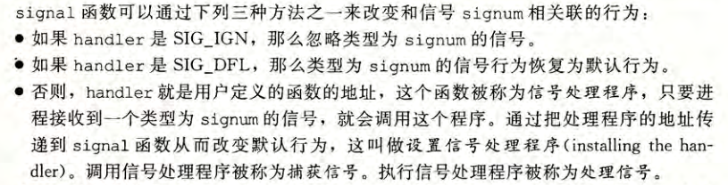

###  计算机硬件

#### 计算机组成

* 总线

* I/O设备

* CPU

* 主存

#### 程序是如何执行的


#### 操作系统是如何管理硬件的

### 数据在计算机中的表示

### 程序在计算机对应的指令


#### 文字段

- 文本段包含进程运行的程序的 *机器语言指令*。
- 此段是*只读的，*因此进程不会通过错误指针意外更改任何值。
- 文本段是*可共享的，*因此程序代码的单个副本一次驻留在虚拟地址空间中。

#### 初始化数据段

- 包含显式初始化的全局变量和静态变量。
- 当程序加载到内存中时，将从可执行文件中读取这些变量的值。

#### 未初始化的数据段

- 包含未显式初始化的全局变量和静态变量。
- 系统将此段中的所有内存初始化为ZERO（0）。
- 该段也称为BSS（由符号开始的块）。
- 没有必要为未初始化的数据分配空间，这就是为什么它们被放置在单独的段中的原因。
- 该段由Loader在运行时分配，因此仅需要记录其位置和大小。

#### 堆栈段

- 堆栈段是包含堆栈帧的动态增长和收缩段。
- 它包含程序堆栈，LIFO结构。注册“堆栈指针”跟踪堆栈的顶部。
- 每个函数都有一个堆栈框架。
- 一个帧存储函数的局部变量参数和返回值。
-  它们存储自动变量和局部变量。

#### 堆段

- 它在运行时存储动态分配的内存。
- malloc，realloc和free在堆区域动态分配，可以使用brk和sbrk系统调用来调整其大小
- 它由进程中的所有共享库和动态加载的模块共享。

!(img/虚拟内存png)

### 处理器体系结构

### 程序性能优化

1. 减少循环中不必要的代码

2. 减少过程调用(方法调用)

3. 减少不必要的内存引用(没必要的 变量)

4. 循环展开:增加每次迭代计算的元素和数量,减少循环迭代次数

5. 提高并行性

   1. 多个累计变量: 

      

   2. 重新结合变换

      

### 存储器层次结构

#### 主存

* SRAM

  稳态 ,速度快 ,抗干扰能力强,一般用作cpu高速缓存.

* DRAM

  非稳态,抗干扰能力弱

#### 磁盘

* 机械磁盘
* ssd

#### 高速缓存


* 缓存操作

  1. 读缓存

     

  2. 写缓存

     

* 缓存结构


### 链接

#### 静态链接

*   符号解析:  目标文件定义和引用符号,每个符号对应一个函数,全局变量或是一个静态变量(static).目的是将每个符号引用刚好和一个符号定义关联起来.

*   重定位: 编译器和汇编器生成从地址0开始的代码和数据节.链接器通过把每个符号定义与一个内存位置关联起来,从而重定义这些节,然后修改所有对这些符号的引用,是他们指向这个内存位置.链接器使用汇编器产生的重定向条目的详细指令,不加甄别的执行这样的重定位.

#### 目标文件

* 可重定位目标文件 (.o文件,gcc -c) 包含二进制代码和数据,可在编译时与其他可重定位目标文件合并起来,创建一个可执行目标文件
* 可执行目标文件 
* 共享目标文件(动态库)一种特殊类型的可重定位目标文件,可以在加载或者运行时被动态的加载进内存并链接.

#### 可重定位目标文件

 


* 构成

  * ELF头:  16字节序列,描述生成该文件的系统的字的大小和字节顺序(大端小端)

  * .text: 已编译程序的机器代码。

  * .todat_a: 只读数据，比如`printf`语句中的格式串和开关语句的跳转表。

  * .data: 已初始化的全局和静态 C 变量。局部 C 变量在运行时被保存在栈中，既不出现在.data 节中，也不出现在 .bss 节中

  * .bss: 未初始化的全局和静态 C 变量，以及所有被初始化为 0 的全局或静态变量。在目标文件中这个节不占据实际的空间，它仅仅是一个占位符。目标文件格式区分已初始化和未初始化变量是为了空间效率：在目标文件中，未初始化变量不需要占据任何实际的磁盘空间。运行时，在内存中分配这些变量，初始值为 0

    

  * .symtab: —个符号表，它存放在程序中定义和引用的函数和全局变量的信息。一些程序员错误地认为必须通过-g 选项来编译一个程序，才能得到符号表信息。实际上，每个可重定位目标文件在 .symtab 中都有一张符号表（除非程序员特意用 STRIP 命令去掉它）。 然而，和编译器中的符号表不同，.symtab 符号表不包含局部变量的条目。

  * .rel.text: —个.text 节中位置的列表，当链接器把这个目标文件和其他文件组合时，需要修改这些位置。一般而言，任何调用外部函数或者引用全局变量的指令都需要修改。另一方面，调用本地函数的指令则不需要修改。注意，可执行目标文件中并不需要重定位信息，因此通常省略，除非用户显式地指示链接器包含这些信息。

  * .rel.data(目前来看已经和.rel.text合并了): 被模块引用或定义的所有全局变量的重定位信息。一般而言，任何已初始化的全局变量，如果它的初始值是一个全局变量地址或者外部定义函数的地址，都需要被修改。 

  * .debug: 一个调试符号表，其条目是程序中定义的局部变量和类型定义，程序中定义和引用的全局变量，以及原始的 C 源文件。只有以-g 选项调用编译器驱动程序时，才会得到这张表。

  * .line: 原始 C 源程序中的行号和.text 节中机器指令之间的映射。只有以-g 选项调用编译器驱动程序时，才会得到这张表。

  * .strtab: —个字符串表，其内容包括 .symtab 和 .debug 节中的符号表，以及节头部中的令名字。字符串表就是以 null 结尾的字符串的序列。

#### 符号和符号表

* 全局符号 :非静态的c函数和全局变量
* 外部符号: 被本模块引用的在其他模块定义的非静态c函数或者全局变量
* 局部符号: 带static属性的c函数和全局变量,这些符号在本模块中可以,其他模块不可见
* 


#### 符号解析


1. 解析全局符号

   函数和已初始化的全局变量是强符号,未初始化的全局变量是弱符号

   1.  不允许有多个同名的强符号
   2.  如果有一个强符号和多个弱符号，那么选择强符号
   3.  如果有多个弱符号，那么从这些弱符号中任选一个

   使用GCC-fno-common 标志，在遇到多重定义的全局符号时，触发一个错误。

   使用-Werror 标志。会把所有的警告变成错误。

2. 与静态库链接

   将所有相关的目标模块打包成为一个单独的文件，称为 静态库（static library)

   **程序调用外部库:**

   * 程序链接到重定位文件,容易出错,耗时

     `linux> gcc main.c /usr/lib/printf.o /usr/lib/scanf.o`

   * 程序链接到重定位文件生成的静态库文件: 链接器只讲被程序引用的目标模块,减少可执行文件在磁盘的内存的大小

     `linux> gcc main.c /usr/lib/libm.a /usr/lib/libc.a`

   **创建静态库**:

   ```shell
   gcc -c addvec.c multvec.c
   ar rcs libvector.a acidvec.o multvec.o
   ```

   

3. 链接器如何使用静态库来解析引用

   链接器维护一个可重定位目标文件的集合 E(这个集合中的文件会被合并起来形成可执行文件）， 一个未解析的符号(即引用了但是尚未定义的符号)集合U,以及一个在前面输人文件中已定义的符号集合D, 初始时E、 U 和 D 均为空。

   * 于命令行上的每个输人文件 f，链接器会判断 f是一个目标文件还是一个存档文件。如果 f是一个目标文件，那么链接器把 f 添加到 E，修改 U 和 D 来反映f中的符号定义和引用，并继续下一个输入文件
   * 如果果是一个存档文件(.a)，那么链接器就尝试匹配U中未解析的符号和由存档文件成员定义的符号。如果某个存档文件成员 m 定义了一个符号来解析 U 中的一个引用，那么就将 m 加到 中，并且链接器修改(U 和 D 来反映 m 中的符号定义和引用。对存档文件中所有的成员目标文件都依次进行这个过程，直到 U和 D都不再发生变化。此时，任何不包含在 E 中的成员目标文件都简单地被丢弃，而链接器将继续处理下一个输入文件。
   * 果当链接器完成对命令行上输人文件的扫描后，U 是非空的，那么链接器就会输出一个错误并终止。否则，它会合并和重定位E中的目标文件，构建输出的可执行文件。

   如果库不是相互独立的，那么必须对它们排序，使得对于每个被存档文件的成员外部引用的符号 S, 在命令行中至少有一个 S 的定义是在对 S 的引用之后的。

4. 重定位

   ​	

   重定位由两步组成

   * 重定位节和符号定义

     相同类型的节合并为同一类型的新的聚合节

   * 重定位节中的符号的引用

     修改节和数据节中对每个符号的引用

     

   1. 重定位条目:

      汇编器遇到对最终位置未知的目标引用，它就会生成一个重定位条目 ，告诉链接器在将目标文件合并成可执行文件时如何修改这个引用。代码的重定位条目放在 .rel.text 中。已初始化数据的重定位条目放在 .rel.data 中。

      ELF 定义了 32 种不同的重定位类型，有些相当隐秘。我们只关心其中两种最基本的
      重定货类型

      * R_X86_64_PC32 重定位一个使用 32 位 PC 相对地址的引用
      * R_X86_64_32ÿ 重定位一个使用 32 位绝对地址的引用

      这两种重定位类型支持 X86-64 小型代码模型（small code model), 该模型假设可执行目标文件中的代码和数据的总体大小小于 2GB, 因此在运行时可以用 32 位 PC 相对地址来访问。GCC 默认使用小型代码模型。大于 2GB 的程序可以用-mcmodel=medium(中型代码模型）和-mcmodel=large(大型代码模型）标志来编译

   2. 重定位符号引用

      * 

   

5. 可执行目标文件

   
   .init 节定义了一个小函数，叫做_init,程序的初始化代码会调用它.
   因为可执行文件是完全链接的（已被重定位）， 所以它不再需要.rel 节。

6. 加载可执行目标文件

   

7. 动态链接共享库

   

   在运行或加载时，可以加载到任意的内存地址，并和一个在内存中的程序链接起来。这个过程称为动态链接(dynamic linking), 是由一个叫做动态链接器（dynamic linker)的程序来执行的。共享库也称为共 享目标（shared object)

   所有引用该库的可执行目标文件共享这个.so文件中的代码和数据

   * 重定位 libc.so 的文本和数据到某个内存段
   * 重定位 libvector.so 的文本和数据到另一个内存段。
   * 重定位 prog21 中所有对由 libc.so 和 libvector.so 定义的符号的引用

8. 从应用程序中加载和链接共享库

   * dlopen  打开共享库
   * dlsysm :输人是一个指向前面已经打开了的共享库的句柄和一个 symbol 名字,如果该符号存在，就返回符号的地址，否则返回 NULL
   * dlclose 卸载共享库
   * dlerror: 返回上面3个方法的错误

9. 位置无关代码 PIC  

   GCC 使用-fpic 选项指示 GNU 编译系统生成 PIC 代码。共享库的编译必须总是使用该选项

   1. PIC 数据引用

      

   2. PIC 函数调用

10. 库打桩机制

    Linux 链接器支持一个很强大的技术，称为库打桩（library interpositioning), 它允许你截获对共享库函数的调用，取而代之执行自己的代码。使用打桩机制，你可以追踪对某个特殊库函数的调用次数，验证和追踪它的输人和输出值，或者甚至把它替换成一个完全不同的实现

    * 编译时打桩
    * 链接时打桩
    * 运行时打桩

11. 处理目标文件的工具

    * AR: 创建静态库，插人、删除、列出和提取成员。
    * STRINGS: 列出一个目标文件中所有可打印的字符串。
    * STRIP: 从目标文件中删除符号表信息。
    * NM: 列出一个目标文件的符号表中定义的符号。
    * SIZE: 列出目标文件中节的名字和大小。
    * READELF: 显示一个目标文件的完整结构，包括 ELF 头中编码的所有信息。包含SIZE 和 NM 的功能。
    * OBJDUMP: 所有二进制工具之母。能够显示一个目标文件中所有的信息。它最大的作用是反汇编 .text 节中的二进制指令。
    * Linux 系统为操作共享库还提供了 LDD 程序：
      LDD: 列出一个可执行文件在运行时所需要的共享库。


### 异常控制流

异常控制流发生在计算机系统的各个层次。比如，在硬件层硬件检测到的事件会触发控制突然转移到异常处理程序。在操作系统层，内核通过上下文切换将控制从一个用户进程转移到另一个用户进程.在应用层，—个进程可以发送信号到另一个进程.

### 异常

1. 异常处理

   

   * 过程调用时，在跳转到处理程序之前，处理器将返回地址压入栈中。然而，根据异常的类型，返回地址要么是当前指令（当事件发生时正在执行的指令）， 要么是下一条指令（如果事件不发生，将会在当前指令后执行的指令）

* 处理器也把一些额外的处理器状态压到栈里，在处理程序返回时，重新开始执行被中断的程序会需要这些状态。比如，X86-64 系统会将包含当前条件码的 EFLAGS寄存器和其他内容压人桟中。
  * 如果控制从用户程序转移到内核，所有这些项目都被压到内核栈中，而不是压到用
    户栈中。
  * 异常处理程序运行在内核模式下（见 8.2.4 节）， 这意味着它们对所有的系统资源都
    有完全的访问权限。

2. 异常处理过程

   > 信号检测与处理的过程[Linux内核信号处理机制介绍](http://www.spongeliu.com/165.html)

   

   处理信号的整个过程是这样的：进程由于 系统调用或者中断 进入内核，完成相应任务返回用户空间的前夕，检查信号队列，如果有信号，则根据信号向量表找到信号处理函数，设置好“frame”后，跳到用户态执行信号处理函数。信号处理函数执行完毕后，返回内核态，设置“frame”，再返回到用户态继续执行程序。

3. 异常类别

4. 

5. linux/x86-64系统中的异常

### 进程

1. 私有地址

   进程也为每个程序提供一种假象，好像它独占地使用系统地址空间,和这个空间中某个地址相关联的那个内存字节是不能被其他进程读或者写的，从这个意义上说，这个地址空间是私有的

2. 用户态和内核态

   ​	处理器通常是用某个控制寄存器中的一个模式位（mode bit)来提供这种功能的，该寄存器描述了进程当前享有的特权。当设置了模式位时，进程就运行在内核模式中（有时叫做超级用 户模式）。 一个运行在内核模式的进程可以执行指令集中的任何指令，并且可以访问系统中的任何内存位置.

   ​	没有设置模式位时，进程就运行在用户模式中。用户模式中的进程不允许执行特权指令(privileged instruction), 比如停止处理器、改变模式位，或者发起一个 I/O 操作。也不允许用户模式中的进程直接引用地址空间中内核区内的代码和数据。任何这样的尝试都会导致致命的保护故障。反之，用户程序必须通过系统调用接口间接地访问内核代码和数据。

   ​	运行应用程序代码的进程初始时是在用户模式中的。进程从用户模式变为内核模式的唯一方法是通过诸如中断、故障或者陷人系统调用这样的异常。当异常发生时，控制传递到异常处理程序，处理器将模式从用户模式变为内核模式。处理程序运行在内核模式中，当它返回到应用程序代码时，处理器就把模式从内核模式改回到用户模式。

### 信号

低层的硬件异常是由内核异常处理程序处理的，正常情况下，对用户进程而言是不可见的。信号提供了一种机制，通知用户进程发生了这些异常。


* 信号传递步骤

  1. 发送信号。内核通过更新目的进程上下文中的某个状态，发送（递送）一个信号给目的进程。发送信号可以有如下两种原因：1)内核检测到一个系统事件，比如除零错误或者子进程终止。2)—个进程调用了 kill 函数（在下一节中讨论）， 显式地要求内核发送一个信号给目的进程。一个进程可以发送信号给它自己。

  2. 接收信号。当目的进程被内核强迫以某种方式对信号的发送做出反应时，它就接收了
     信号。进程可以忽略这个信号，终止或者通过执行一个称为信号处理程序(signal han¬
     dler)的用户层函数捕获这个信号

     一个发出而没有被接收的信号叫做待处理信号（pending signal) 在任何时刻，一种类型至多只会有一个待处理信号。如果一个进程有一个类型为k的待处理信号，那么任何接下来发送到这个进程的类型为k的信号都不 会排队等待；它们只是被简单地丢弃。一个进程可以有选择性地阻塞接收某种信号。当一种信号被阻塞时，它仍可以被发送，但是产生
     的待处理信号不会被接收，直到进程取消对这种信号的阻塞。
      一个待处理信号最多只能被接收一次。内核为每个进程在 pending 位向量中维护着待处理信号的集合，而在 blocked 位向量e中维护着被阻塞的信号集合。只要传送了一个类型为k的信号，内核就会设置 pending 中的第k位，而只要接收了一个类型为k的信号，内核就会清除 penaing 中的第 k位。

* 接收信号

  每个信号类型都有一个预定义的默认行为 ，是下面中的一种:

  * 程序终止。
  * 进程终止并转储内存。
  * 进程停止(挂起)直到被 SIGCONT 信号重启。
  * 进程忽略该信号

  收到 SIGKILL 的默认行为就是终止接收进程。另外，接收到 SIGCHLD 的默认行为就是忽略这个信号。进程可以通过使用 signal 函数修改和信号相关联的默认行为。唯一的例外是 SIGSTOP 和 SIGKILL它们的默认行为是不能修改的。

  

  

  

* 信号处理函数准则

  - 信号处理函数尽量只执行简单的操作，譬如只是设置一个外部变量，其它复杂的操作留在信号处理函数之外执行；所有与接收信号相关的处理都由主程序执行，它周期性地检查(并重置)这个标志

- `errno` 是线程安全，即每个线程有自己的` errno`，但不是异步信号安全。如果信号处理函数比较复杂，且调用了可能会改变` errno` 值的库函数，必须考虑在信号处理函数开始时保存、结束的时候恢复被中断线程的` errno` 值；

- 信号处理函数只能调用可以重入的 C 库函数；譬如不能调用` malloc（），free（）`以及标准 I/O 库函数等；

  

  - 信号处理函数如果需要访问全局变量，在定义此全局变量时须将其声明为 `volatile，`以避免编译器不恰当的优化。

  [信号处理函数会遇到的问题](http://blog.sina.com.cn/s/blog_61e531350100p7vp.html)

  * 有程序死锁的危险

    o 这是那些依赖于某一时刻，而且错误再现比较困难的BUG产生的真正原因 
    o 死锁是一个比较典型的例子，除此之外还能引起函数返回值不正确，以及在某一函数内执行时突然收到SEGV信号等的误操作。
       ◆译者注1：SEGV通常发生在进程试图访问无效内存区域时（可能是个NULL指针，或超出进程空间之外的内存地址）。当bug原因和SEGV影响在不同时间呈现时，它们特别难于捕获到。

  * 由于编译器无意识的优化操作，有导致程序紊乱的危险 

### 虚拟内存

### 系统级I/O

### 网络编程

### 并发编程

