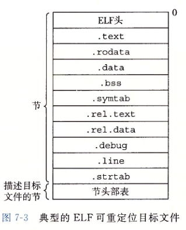
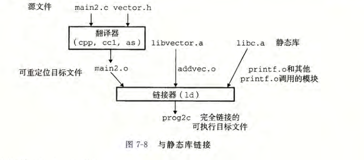
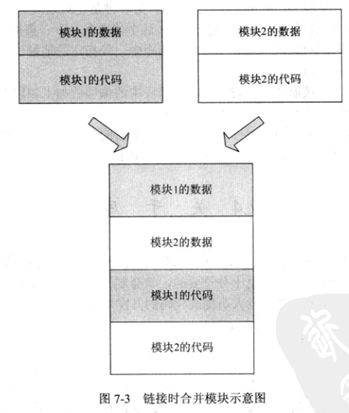
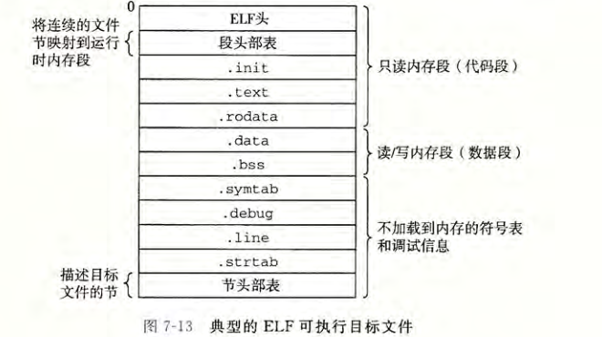

## 链接

---

### 0.工具

objdump

readelf

### 1. 静态链接

*   符号解析:  目标文件定义和引用符号,每个符号对应一个函数,全局变量或是一个静态变量(static).目的是将每个符号引用刚好和一个符号定义关联起来.

* 重定位: 编译器和汇编器生成从地址0开始的代码和数据节.链接器通过把每个符号定义与一个内存位置关联起来,从而重定义这些节,然后修改所有对这些符号的引用,是他们指向这个内存位置.链接器使用汇编器产生的重定向条目的详细指令,不加甄别的执行这样的重定位.

### 2. 目标文件

* 可重定位目标文件 (.o文件,gcc -c) 包含二进制代码和数据,可在编译时与其他可重定位目标文件合并起来,创建一个可执行目标文件
* 可执行目标文件 
* 共享目标文件(动态库)一种特殊类型的可重定位目标文件,可以在加载或者运行时被动态的加载进内存并链接.

### 3. 可重定位目标文件

 

* 构成
  * 节
    * ELF头:  16字节序列,描述生成该文件的系统的字的大小和字节顺序(大端小端)
    
    * .text: 已编译程序的机器代码。
    
    * .todat_a: 只读数据，比如`printf`语句中的格式串和开关语句的跳转表。
    
    * .data: 已初始化的全局和静态 C 变量。局部 C 变量在运行时被保存在栈中，既不出现在.data 节中，也不出现在 .bss 节中
    
    * .bss: 未初始化的全局和静态 C 变量，以及所有被初始化为 0 的全局或静态变量。在目标文件中这个节不占据实际的空间，它仅仅是一个占位符。目标文件格式区分已初始化和未初始化变量是为了空间效率：在目标文件中，未初始化变量不需要占据任何实际的磁盘空间。运行时，在内存中分配这些变量，初始值为 0
    
      
    
    * .symtab: —个符号表，它存放在程序中定义和引用的函数和全局变量的信息。一些程序员错误地认为必须通过-g 选项来编译一个程序，才能得到符号表信息。实际上，每个可重定位目标文件在 .symtab 中都有一张符号表（除非程序员特意用 STRIP 命令去掉它）。 然而，和编译器中的符号表不同，.symtab 符号表不包含局部变量的条目。
    
    * .symtab: —个符号表，它存放在程序中定义和引用的函数和全局变量的信息。一些程序员错误地认为必须通过-g 选项来编译一个程序，才能得到符号表信息。实际上，每个可重定位目标文件在 .symtab 中都有一张符号表（除非程序员特意用 STRIP 命令去掉它）。 然而，和编译器中的符号表不同，.symtab 符号表不包含局部变量的条目。
    
    * .rel.text: —个.text 节中位置的列表，当链接器把这个目标文件和其他文件组合时，需要修改这些位置。一般而言，任何调用外部函数或者引用全局变量的指令都需要修改。另一方面，调用本地函数的指令则不需要修改。注意，可执行目标文件中并不需要重定位信息，因此通常省略，除非用户显式地指示链接器包含这些信息。
    
    * .rel.data: 被模块引用或定义的所有全局变量的重定位信息。一般而言，任何已初始化的全局变量，如果它的初始值是一个全局变量地址或者外部定义函数的地址，都需要被修改。
    
    * .debug: 一个调试符号表，其条目是程序中定义的局部变量和类型定义，程序中定义和引用的全局变量，以及原始的 C 源文件。只有以-g 选项调用编译器驱动程序时，才会得到这张表。
    
    * .line: 原始 C 源程序中的行号和.text 节中机器指令之间的映射。只有以-g 选项调用编译器驱动程序时，才会得到这张表。
    
    * .strtab: —个字符串表，其内容包括 .symtab 和 .debug 节中的符号表，以及节头部中的令名字。字符串表就是以 null 结尾的字符串的序列。

### 4. 符号和符号表

* 全局符号 :非静态的c函数和全局变量
* 外部符号: 被本模块引用的在其他模块定义的非静态c函数或者全局变量
* 局部符号: 带static属性的c函数和全局变量,这些符号在本模块中可以,其他模块不可见

### 5. 符号和符号表


### 6.符号解析


1. 解析全局符号

   函数和已初始化的全局变量是强符号,未初始化的全局变量是弱符号

   1.  不允许有多个同名的强符号
   2.  如果有一个强符号和多个弱符号，那么选择强符号
   3.  如果有多个弱符号，那么从这些弱符号中任选一个

   使用GCC-fno-common 标志，在遇到多重定义的全局符号时，触发一个错误。

   使用-Werror 标志。会把所有的警告变成错误。

2. 与静态库链接

   将所有相关的目标模块打包成为一个单独的文件，称为 静态库（static library)

   **程序调用外部库:**

   * 程序链接到重定位文件,容易出错,耗时

     `linux> gcc main.c /usr/lib/printf.o /usr/lib/scanf.o`

   * 程序链接到重定位文件生成的静态库文件: 链接器只讲被程序引用的目标模块,减少可执行文件在磁盘的内存的大小

     `linux> gcc main.c /usr/lib/libm.a /usr/lib/libc.a`

   **创建静态库**:

   ```shell
   gcc -c addvec.c multvec.c
   ar rcs libvector.a acidvec.o multvec.o
   ```

   

3. 链接器如何使用静态库来解析引用

   链接器维护一个可重定位目标文件的集合 E(这个集合中的文件会被合并起来形成可执行文件）， 一个未解析的符号(即引用了但是尚未定义的符号)集合U,以及一个在前面输人文件中已定义的符号集合D, 初始时E、 U 和 D 均为空。

   * 于命令行上的每个输人文件 f，链接器会判断 f是一个目标文件还是一个存档文件。如果 f是一个目标文件，那么链接器把 f 添加到 E，修改 U 和 D 来反映f中的符号定义和引用，并继续下一个输入文件
   * 如果果是一个存档文件(.a)，那么链接器就尝试匹配U中未解析的符号和由存档文件成员定义的符号。如果某个存档文件成员 m 定义了一个符号来解析 U 中的一个引用，那么就将 m 加到 中，并且链接器修改(U 和 D 来反映 m 中的符号定义和引用。对存档文件中所有的成员目标文件都依次进行这个过程，直到 U和 D都不再发生变化。此时，任何不包含在 E 中的成员目标文件都简单地被丢弃，而链接器将继续处理下一个输入文件。
   * 果当链接器完成对命令行上输人文件的扫描后，U 是非空的，那么链接器就会输出一个错误并终止。否则，它会合并和重定位E中的目标文件，构建输出的可执行文件。

   如果库不是相互独立的，那么必须对它们排序，使得对于每个被存档文件的成员外部引用的符号 S, 在命令行中至少有一个 S 的定义是在对 S 的引用之后的。

4. 重定位

   ​	

   重定位由两步组成

   * 重定位节和符号定义

     相同类型的节合并为同一类型的新的聚合节

   * 重定位节中的符号的引用

     修改节和数据节中对每个符号的引用

     

   1. 重定位条目:

      汇编器遇到对最终位置未知的目标引用，它就会生成一个重定位条目 ，告诉链接器在将目标文件合并成可执行文件时如何修改这个引用。代码的重定位条目放在 .rel.text 中。已初始化数据的重定位条目放在 .rel.data 中。

      ELF 定义了 32 种不同的重定位类型，有些相当隐秘。我们只关心其中两种最基本的
      重定货类型

      * R_X86_64_PC32 重定位一个使用 32 位 PC 相对地址的引用
      * R_X86_64_32ÿ 重定位一个使用 32 位绝对地址的引用

      这两种重定位类型支持 X86-64 小型代码模型（small code model), 该模型假设可执行目标文件中的代码和数据的总体大小小于 2GB, 因此在运行时可以用 32 位 PC 相对地址来访问。GCC 默认使用小型代码模型。大于 2GB 的程序可以用-mcmodel=medium(中型代码模型）和-mcmodel=large(大型代码模型）标志来编译

   2. 重定位符号引用

      * 

   

5. 可执行目标文件

   
   .init 节定义了一个小函数，叫做_init,程序的初始化代码会调用它.
   因为可执行文件是完全链接的（已被重定位）， 所以它不再需要.rel 节。

6. 加载可执行目标文件

   

7. 动态链接共享库

   

   在运行或加载时，可以加载到任意的内存地址，并和一个在内存中的程序链接起来。这个过程称为动态链接(dynamic linking), 是由一个叫做动态链接器（dynamic linker)的程序来执行的。共享库也称为共 享目标（shared object)

   所有引用该库的可执行目标文件共享这个.so文件中的代码和数据

   * 重定位 libc.so 的文本和数据到某个内存段
   * 重定位 libvector.so 的文本和数据到另一个内存段。
   * 重定位 prog21 中所有对由 libc.so 和 libvector.so 定义的符号的引用

8. 从应用程序中加载和链接共享库

   * dlopen  打开共享库
   * dlsysm :输人是一个指向前面已经打开了的共享库的句柄和一个 symbol 名字,如果该符号存在，就返回符号的地址，否则返回 NULL
   * dlclose 卸载共享库
   * dlerror: 返回上面3个方法的错误

9. 位置无关代码 PIC  

   GCC 使用-fpic 选项指示 GNU 编译系统生成 PIC 代码。共享库的编译必须总是使用该选项

   1. PIC 数据引用

      

   2. PIC 函数调用

10. 库打桩机制

    Linux 链接器支持一个很强大的技术，称为库打桩（library interpositioning), 它允许你截获对共享库函数的调用，取而代之执行自己的代码。使用打桩机制，你可以追踪对某个特殊库函数的调用次数，验证和追踪它的输人和输出值，或者甚至把它替换成一个完全不同的实现

    * 编译时打桩
    * 链接时打桩
    * 运行时打桩

11. 处理目标文件的工具

    * AR: 创建静态库，插人、删除、列出和提取成员。
    * STRINGS: 列出一个目标文件中所有可打印的字符串。
    * STRIP: 从目标文件中删除符号表信息。
    * NM: 列出一个目标文件的符号表中定义的符号。
    * SIZE: 列出目标文件中节的名字和大小。
    * READELF: 显示一个目标文件的完整结构，包括 ELF 头中编码的所有信息。包含SIZE 和 NM 的功能。
    * OBJDUMP: 所有二进制工具之母。能够显示一个目标文件中所有的信息。它最大的作用是反汇编 .text 节中的二进制指令。
    * Linux 系统为操作共享库还提供了 LDD 程序：
      LDD: 列出一个可执行文件在运行时所需要的共享库。

###  问题

1. 没看懂位置无关代码实现 
2. 不同进程如何共享so库 ,如果so库中有变量,这个进程改了其他进程会不会变

