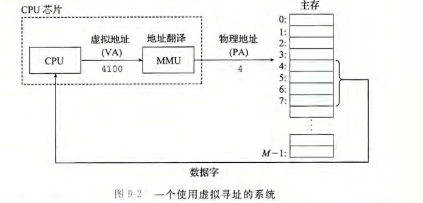

## 虚拟内存

---

虚拟内存提供了三个重要的能力:

* 它将主存看成是一个存储在磁盘上的地址空间的高速缓存，在主存中只保存活动区域，并根据需要在磁盘和主存之间来回传送数据，通过这种方式，它高效地使用了主存。
* 它为每个进程提供了一致的地址空间，从而简化了内存管理。
* 它保护了每个进程的地址空间不被其他进程破坏

### 物理和虚拟寻址

使用虚拟寻址，CPU 通过生成一个虚拟地址（Virtual Addressÿ VA)来访问主存，这个虚拟地址在被送到内存之前先转换成适当的物理地址。将一个虚拟地址转换为物理地址的任务叫做地址翻译（address translation)就像异常处理一样，地址翻译需要 CPU 硬件和操作系统之间的紧密合作。CPU 芯片上叫做内存管理单元（Memory Management Unit,MMU)的专用硬件，利用存放在主存中的查询表来动态翻译虚拟地址，该表的内容由操作系统管理。

### 地址空间

地址空间（address space)是一个非负整数地址的有序集合

### 内存映射 

私有对象使用一种叫做写时复制（copy-on-write)的巧妙技术被映射到虚拟内存中

私有对象开始生命周期的方式基本上与共享对象的一样，在物理内存中只保存有私有对象的
一份副本。比如，图 9-30a 展示了一种情况，其中两个进程将一个私有对象映射到它们虚拟内
存的不同区域，但是共享这个对象同一个物理副本。对于每个映射私有对象的进程，相应私有
区域的页表条目都被标记为只读，并且区域结构被标记为私有的写时复制。只要没有进程试图
写它自己的私有区域，它们就可以继续共享物理内存中对象的一个单独副本。然而，只要有一
个进程试图写私有区域内的某个页面，那么这个写操作就会触发一个保护故障。
当故障处理程序注意到保护异常是由于进程试图写私有的写时复制区域中的一个页面
而引起的，它就会在物理内存中创建这个页面的一个新副本，更新页表条目指向这个新的
副本，然后恢复这个页面的可写权限，如图 9-30b 所示。当故障处理程序返回时，CPU 重
新执行这个写操作，现在在新创建的页面上这个写操作就可以正常执行了。

