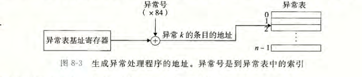
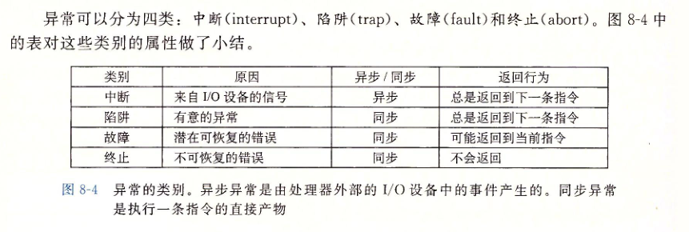
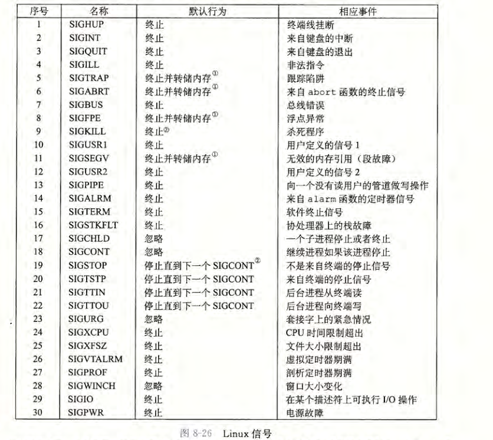
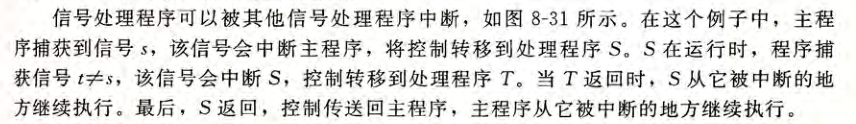

## 异常控制流

异常控制流发生在计算机系统的各个层次。比如，在硬件层硬件检测到的事件会触发控制突然转移到异常处理程序。在操作系统层，内核通过上下文切换将控制从一个用户进程转移到另一个用户进程.在应用层，—个进程可以发送信号到另一个进程.

### 异常

1. 异常处理

   

   * 过程调用时，在跳转到处理程序之前，处理器将返回地址压入栈中。然而，根据异常的类型，返回地址要么是当前指令（当事件发生时正在执行的指令）， 要么是下一条指令（如果事件不发生，将会在当前指令后执行的指令）
* 处理器也把一些额外的处理器状态压到栈里，在处理程序返回时，重新开始执行被中断的程序会需要这些状态。比如，X86-64 系统会将包含当前条件码的 EFLAGS寄存器和其他内容压人桟中。
   * 如果控制从用户程序转移到内核，所有这些项目都被压到内核栈中，而不是压到用
     户栈中。
   * 异常处理程序运行在内核模式下（见 8.2.4 节）， 这意味着它们对所有的系统资源都
     有完全的访问权限。
   
2. 异常处理过程

   > 信号检测与处理的过程[Linux内核信号处理机制介绍](http://www.spongeliu.com/165.html)

   

   处理信号的整个过程是这样的：进程由于 系统调用或者中断 进入内核，完成相应任务返回用户空间的前夕，检查信号队列，如果有信号，则根据信号向量表找到信号处理函数，设置好“frame”后，跳到用户态执行信号处理函数。信号处理函数执行完毕后，返回内核态，设置“frame”，再返回到用户态继续执行程序。

3. 异常类别

4. 

5. linux/x86-64系统中的异常

### 进程

1. 私有地址

   进程也为每个程序提供一种假象，好像它独占地使用系统地址空间,和这个空间中某个地址相关联的那个内存字节是不能被其他进程读或者写的，从这个意义上说，这个地址空间是私有的

2. 用户态和内核态

   ​	处理器通常是用某个控制寄存器中的一个模式位（mode bit)来提供这种功能的，该寄存器描述了进程当前享有的特权。当设置了模式位时，进程就运行在内核模式中（有时叫做超级用 户模式）。 一个运行在内核模式的进程可以执行指令集中的任何指令，并且可以访问系统中的任何内存位置.

   ​	没有设置模式位时，进程就运行在用户模式中。用户模式中的进程不允许执行特权指令(privileged instruction), 比如停止处理器、改变模式位，或者发起一个 I/O 操作。也不允许用户模式中的进程直接引用地址空间中内核区内的代码和数据。任何这样的尝试都会导致致命的保护故障。反之，用户程序必须通过系统调用接口间接地访问内核代码和数据。

   ​	运行应用程序代码的进程初始时是在用户模式中的。进程从用户模式变为内核模式的唯一方法是通过诸如中断、故障或者陷人系统调用这样的异常。当异常发生时，控制传递到异常处理程序，处理器将模式从用户模式变为内核模式。处理程序运行在内核模式中，当它返回到应用程序代码时，处理器就把模式从内核模式改回到用户模式。

### 信号

低层的硬件异常是由内核异常处理程序处理的，正常情况下，对用户进程而言是不可见的。信号提供了一种机制，通知用户进程发生了这些异常。

* 信号传递步骤

  1. 发送信号。内核通过更新目的进程上下文中的某个状态，发送（递送）一个信号给目的进程。发送信号可以有如下两种原因：1)内核检测到一个系统事件，比如除零错误或者子进程终止。2)—个进程调用了 kill 函数（在下一节中讨论）， 显式地要求内核发送一个信号给目的进程。一个进程可以发送信号给它自己。
  2. 接收信号。当目的进程被内核强迫以某种方式对信号的发送做出反应时，它就接收了
     信号。进程可以忽略这个信号，终止或者通过执行一个称为信号处理程序(signal han¬
     dler)的用户层函数捕获这个信号

     一个发出而没有被接收的信号叫做待处理信号（pending signal) 在任何时刻，一种类型至多只会有一个待处理信号。如果一个进程有一个类型为k的待处理信号，那么任何接下来发送到这个进程的类型为k的信号都不 会排队等待；它们只是被简单地丢弃。一个进程可以有选择性地阻塞接收某种信号。当一种信号被阻塞时，它仍可以被发送，但是产生
  的待处理信号不会被接收，直到进程取消对这种信号的阻塞。
      一个待处理信号最多只能被接收一次。内核为每个进程在 pending 位向量中维护着待处理信号的集合，而在 blocked 位向量e中维护着被阻塞的信号集合。只要传送了一个类型为k的信号，内核就会设置 pending 中的第k位，而只要接收了一个类型为k的信号，内核就会清除 penaing 中的第 k位。

* 接收信号

  每个信号类型都有一个预定义的默认行为 ，是下面中的一种:

  * 程序终止。
  * 进程终止并转储内存。
  * 进程停止(挂起)直到被 SIGCONT 信号重启。
  * 进程忽略该信号

  收到 SIGKILL 的默认行为就是终止接收进程。另外，接收到 SIGCHLD 的默认行为就是忽略这个信号。进程可以通过使用 signal 函数修改和信号相关联的默认行为。唯一的例外是 SIGSTOP 和 SIGKILL它们的默认行为是不能修改的。

  

  

  

* 信号处理函数准则

  - 信号处理函数尽量只执行简单的操作，譬如只是设置一个外部变量，其它复杂的操作留在信号处理函数之外执行；所有与接收信号相关的处理都由主程序执行，它周期性地检查(并重置)这个标志
  
- `errno` 是线程安全，即每个线程有自己的` errno`，但不是异步信号安全。如果信号处理函数比较复杂，且调用了可能会改变` errno` 值的库函数，必须考虑在信号处理函数开始时保存、结束的时候恢复被中断线程的` errno` 值；
  
- 信号处理函数只能调用可以重入的 C 库函数；譬如不能调用` malloc（），free（）`以及标准 I/O 库函数等；
  
  
  
  - 信号处理函数如果需要访问全局变量，在定义此全局变量时须将其声明为 `volatile，`以避免编译器不恰当的优化。
  
  [信号处理函数会遇到的问题](http://blog.sina.com.cn/s/blog_61e531350100p7vp.html)
  
  *  有程序死锁的危险
  
    o 这是那些依赖于某一时刻，而且错误再现比较困难的BUG产生的真正原因 
    o 死锁是一个比较典型的例子，除此之外还能引起函数返回值不正确，以及在某一函数内执行时突然收到SEGV信号等的误操作。
       ◆译者注1：SEGV通常发生在进程试图访问无效内存区域时（可能是个NULL指针，或超出进程空间之外的内存地址）。当bug原因和SEGV影响在不同时间呈现时，它们特别难于捕获到。
  
  * 由于编译器无意识的优化操作，有导致程序紊乱的危险 

