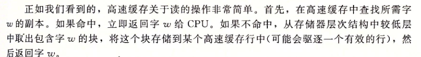
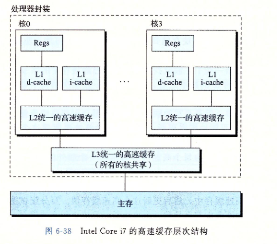

## 存储技术

#### 主存

随机访问存储器(Random-AccessMemory,RAM)分为两类:静态的和动态的.静态RAM(SRAM)比动态RAM(DRAM)更快,但也贵得多.

* SRAM

  SRAM存储器单元的双稳态特性,只要有电,它就会永远地保持它的值,抗干扰能力强

* DRAM

  DRAM将每个位存储为对一个电容的充电,DRAM 存储器单元对干扰非常敏感。当电容的电压被扰乱之后,它
  就永远不会恢复了

#### 磁盘

* 机械磁盘
* ssd

#### 高速缓存

* 缓存操作

  1.  读缓存

     

  2. 写缓存

     

* 缓存结构

