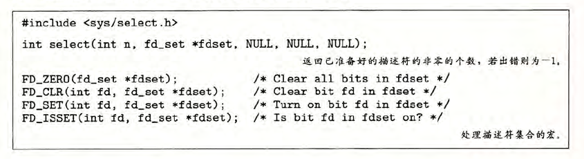
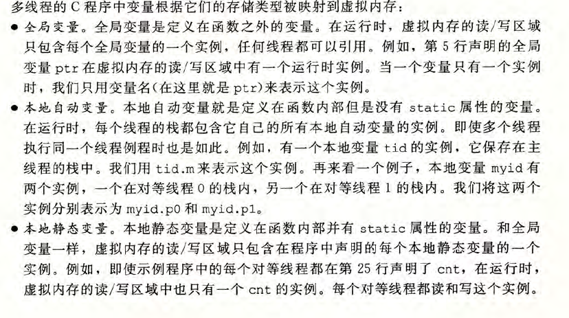
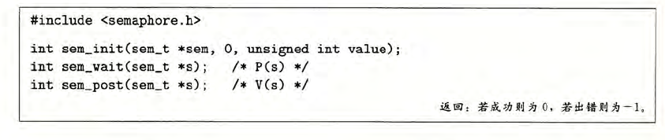
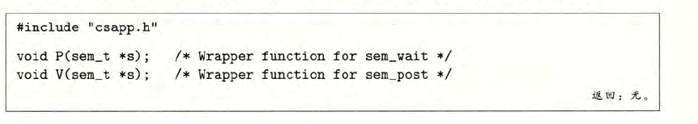

## 并发编程

### 多路复用I/O

**select**

解决1024以下客户端时使用select是很合适的，但如果链接客户端过多，select采用的是轮询模型，会大大降低服务器响应效率，不应在select上投入更多精力

* select 函数有 两个输 入:一 个称为 读集合 的描述 符集合 (fdset)和该读集合的基数 (n)  即fd+1

*  select 有一个副作用,它修 改参数fdset 指向的 fd_setÿ 指明读集 合的一 个子集 ,称 为准备 好集合 (ready set), 这 个集合是由读集 合中准 好可以 读了的 描述符 组成的。该函 数返回 的值指 明了准 备好集 合的基数 。注意 ,由于 这个副 作用,我们必须在每次调用 select 时都更新读 集合

### 关于FD

1. 在打开一个新的fd的时候fd会增长,关掉一个fd时fd会减少
2. fork 进程后子进程fd需要是随父进程fd的来增长的

## 线程 

* 线程的内存模型

  每个线 程都有 它自己 独立的 线程上 下文,包 括线程 ID、栈、栈指针 、程序 计数器 、条件码 和通用目的寄 存器值。每 个线程 和其他线程一起 共享进 程上下 文的剩 余部分。这 包括整 个用户 虚拟地 址空间 ,它 是由只读文本(代码 )、 读 /写数据 、堆以 及所有 的共享 库代码 和数据 区域组 成的。线程也 共享相同的打开 文件的 集合。

  让一个 线程去读或写另一个线程的 寄存器 值是不 可能的 。另一方面 ,任何线程都可以访问共享 虚拟内存的任 意位置 。如果 某个线 程修改 了一个 内存位置 ,那么其他每个线程 最终都 能在它 读这个位置时发现这 个变化。因此 *寄 存器是从不共
  享的 ,而虚 拟内存 总是共享的。*

* 变量映射到内存

  

### 信号量

