## 系统级I/O

### 读文件

* 读 时遇到 EOF:假设我 们准备 读一个 文件,该文件 从当前 文件位 置开始 只含有
   20多个字节 ,而 我们以 50 个字节 的片进 行读取。这样 一来,下一个 read 返回 的不足
  值为 20, 此后的 read 将通 过返回 不足值 0 来发出 EOF 信号。
* 从终端读 文本行:如果 打开文 件是与 终端相 关联的(如 键盘和 显示器 ), 那 么每个
  read 函数将 一次传送一个文本行 ,返 回的不足值 等于文本行的 大小。读和 写网络 套接字(socket)。 
* 如果打 开的文 件对应 于网络 套接字(11.4 节 ), 那么内部 缓冲约束和较 长的网 络延迟 会引起 read 和 write 返回 不足值。对 Linux 管道
  (pipe) 调用 read 和 write 时 ,也 有可能 出现不 足值,这种进 程间通 信机制 不在我们讨论的范围之内。

### io使用推荐

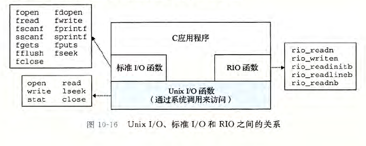

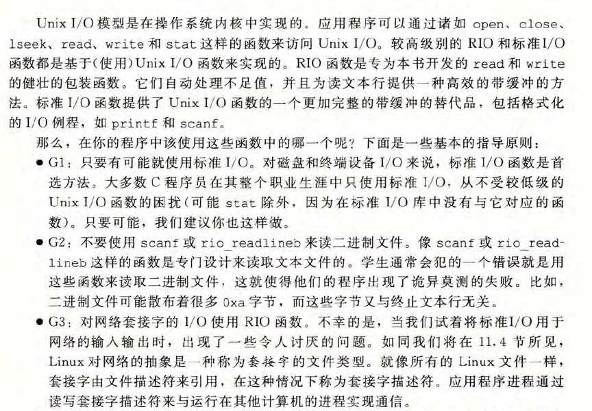

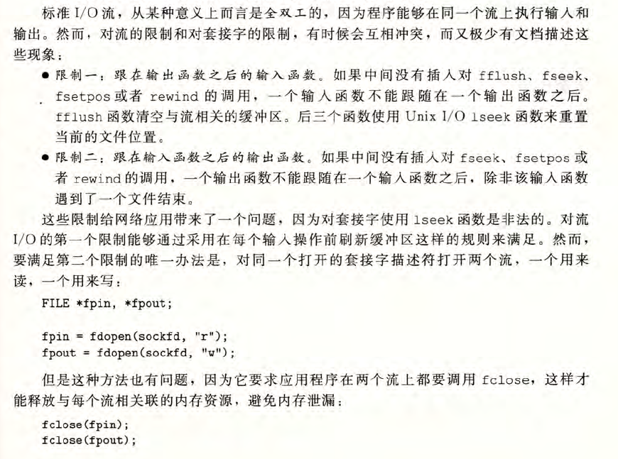

###  RIO包健壮地读写

* 无 缓冲的 输入输 出函数 。这 些函数 直接在内存和 文件之 间传送 数据,没有应用级缓冲。 它们对 将二进制数据读写到 网络和从网络 读写二进制数据尤其有用。

  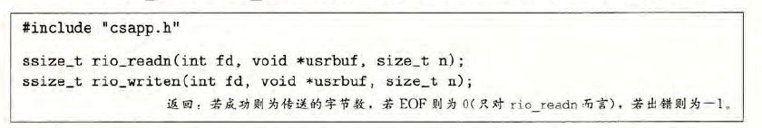

* 带缓 冲的输 入函数 。这些函数允许你高效地 从文件中读取 文本行 和二进 制数据 ,这些 文件的内容缓存在应 用级缓 冲区内 ,类 似于为 printf 这样的标准 I/O 函 数提供的缓冲区 。与 [110] 中讲 述的带 缓冲的 I/O 例 程不同 ,带 缓冲的 RI 输 入函 数是线程安全的 (12.7.1 节 ), 它在同一个描述符 上可以 被交错 地调用。例如 ,你可 以从一个描 述符中读一些 文本行 ,然后 读取一 些二进 制数据 , 接着再多读取一些文本行。

  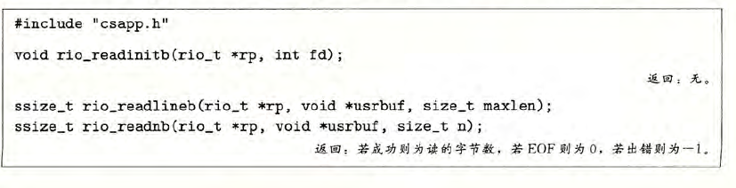

### 读取文件元数据

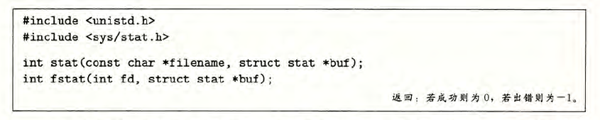

stat 函数以一个文 件名作为输入
fstat 函数是相似的 ,只不过是以 文件描述符而不是文 件名作 为输人 。

### 读取文件目录

* opendir

  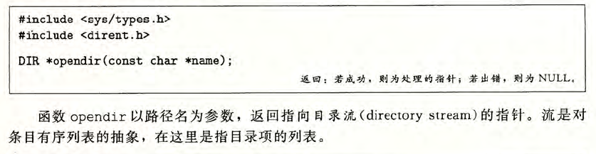

* readdir

  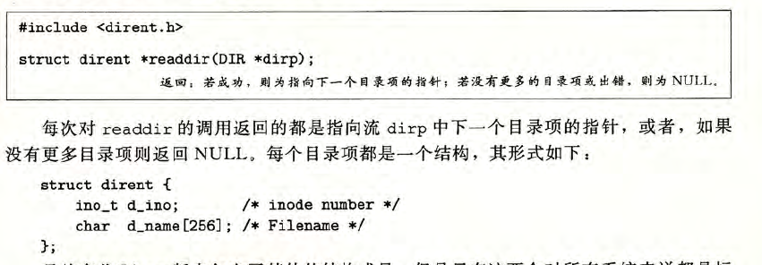

* closedir

  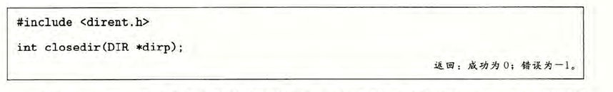

### 共享文件

* 描述符表(fd table)

  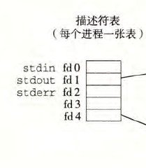

### I/O重定向

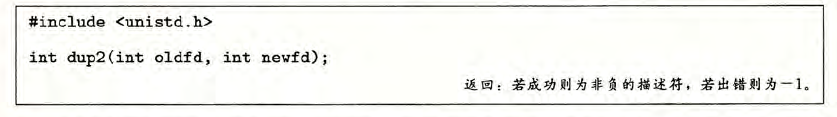

### 标准I/O

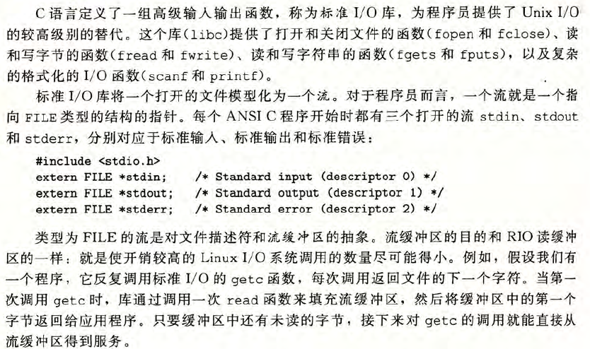

