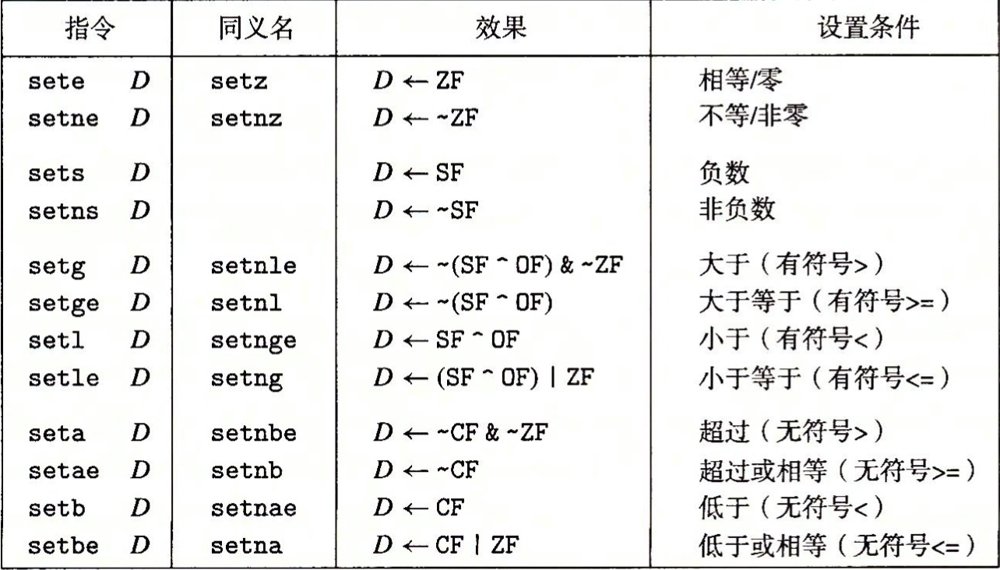
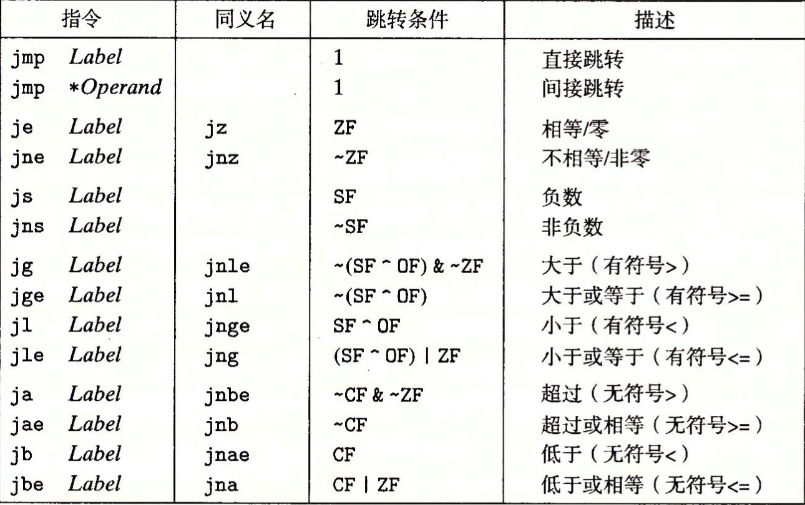
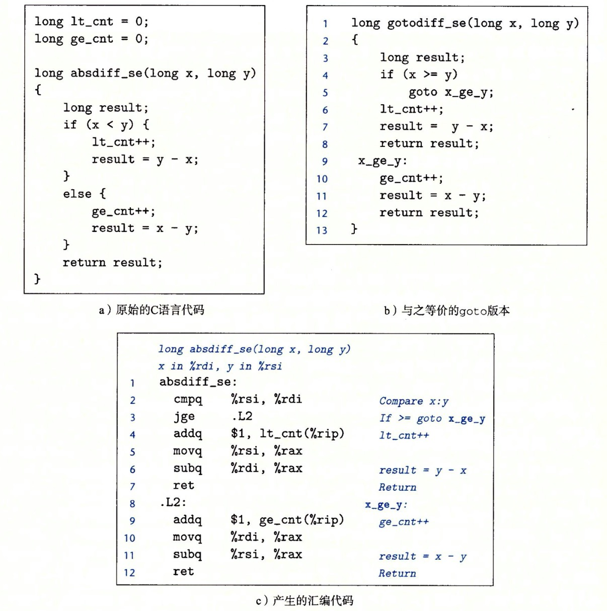
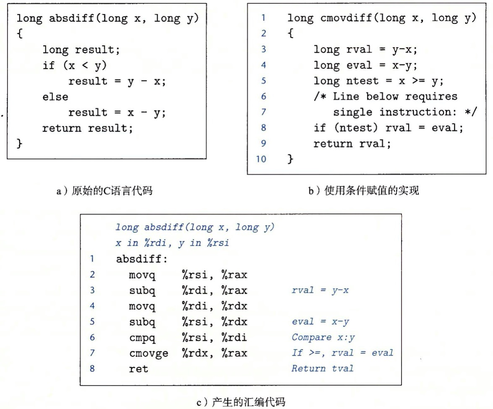
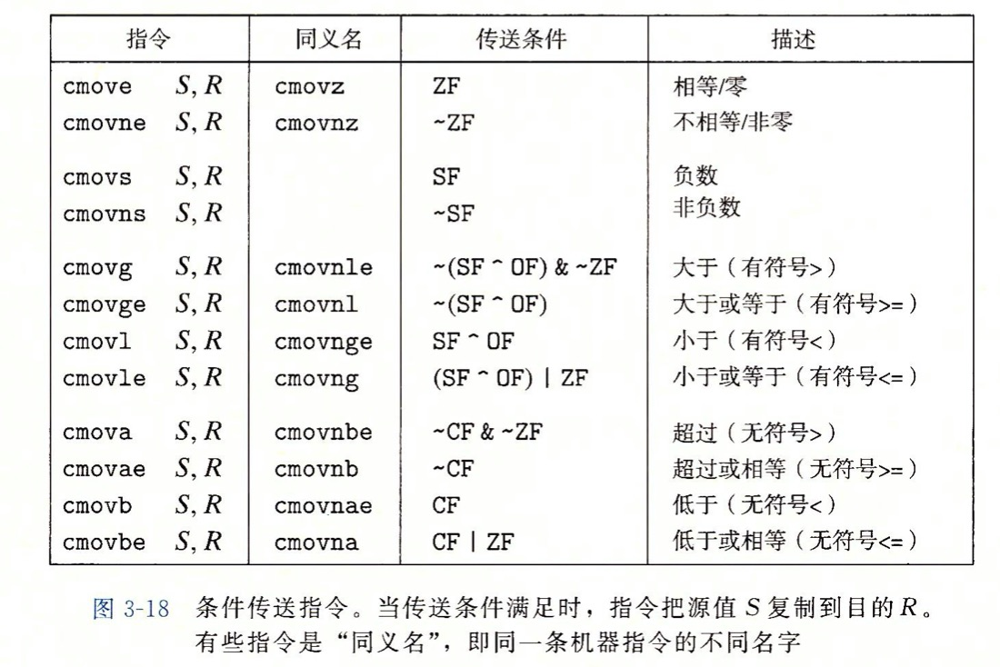
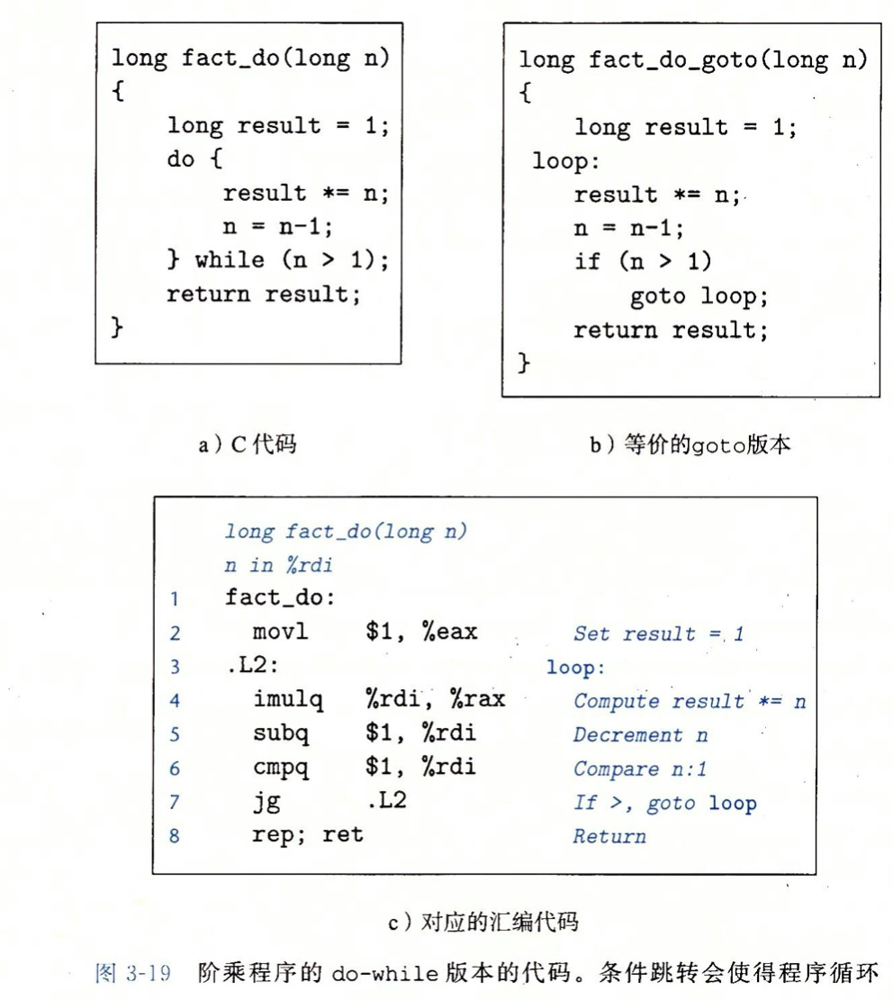
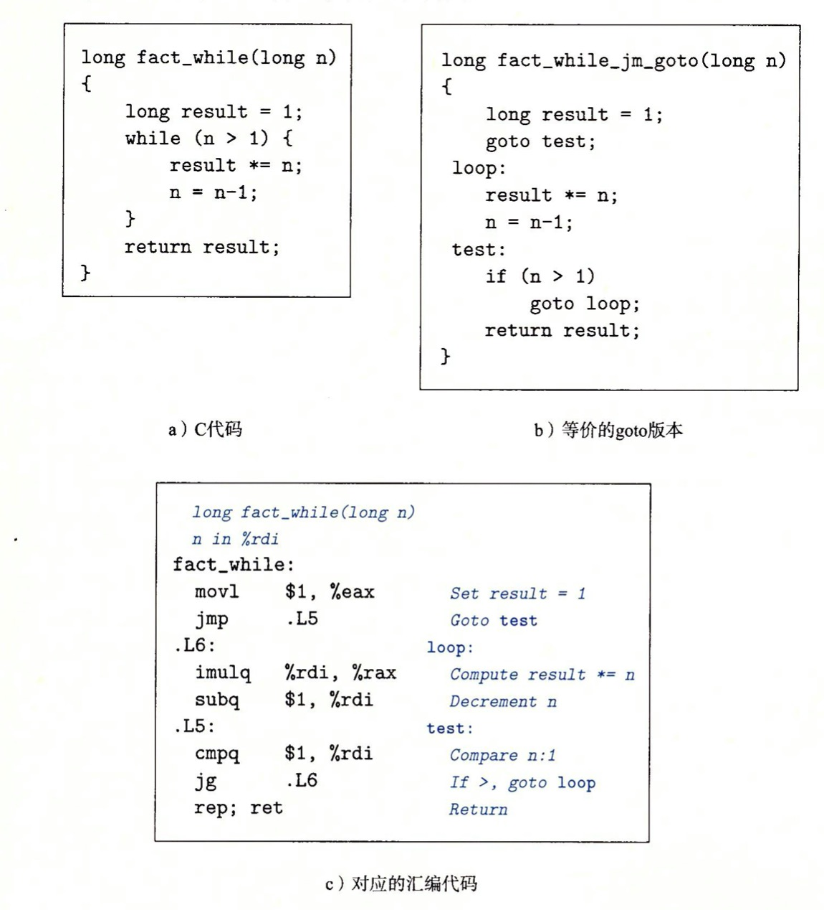
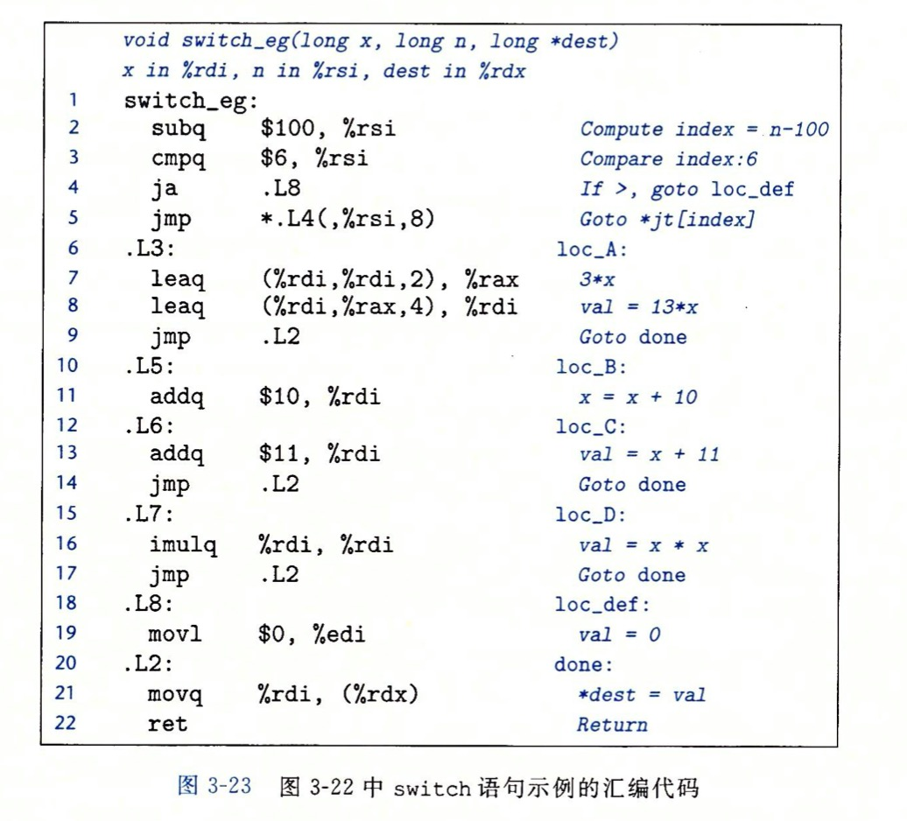
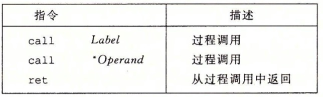

#### 第三章 程序的机器级表示

#### 程序编码

* 假设一个 C 程序有两个文件 p1.c 和 p2.c，用 Unix 命令行编译这些代码: linux> gcc -Og -o p p1.c p2.c
  * gcc 是Linux上默认的用来编译 C 的编译器
  * -Og 会优化编译后的机器代码，增强可读性
  * 源代码转换成可执行代码的流程
    * C 预处理器扩展源代码，插入所有 #include 命令指定的文件，扩展 #define 声明指令的宏
    * 编译器产生两个汇编代码，分别为 p1.s 和 p2.s
    * 汇编器将汇编代码转换成二进制目标代码文件 p1.o 和 p2.o，目标代码是机器代码的一种形式，它包含所有的二进制表示
    * 最后，链接器将两个目标代码文件与实现库函数(如 printf) 代码合并，并产生最终的可执行代码 p （有 -o p 指定的）

##### 机器级代码

* 汇编代码表示非常接近接近机器代码，与机器代码的二进制格式相比，汇编代码的主要特点是它用可读性更好的文本格式表示
* 在机器代码中 C 语言的聚合数据类型(如数组和结构) 用一组连续的字节表示，即使对标量数据类型，汇编代码也不区分有符号数和无符号数，不区分各种类型的指针，不区分指针和整数
* 机器执行的程序只是一个字节序列，它是对一系列指令的编码，机器对产生这些指令的源代码一无所知
* 生成汇编代码 gcc -Og -S mstore.c  生成二进制文件 gcc -Og -C mstore.c

汇编代码示例

```
	.section	__TEXT,__text,regular,pure_instructions
	.build_version macos, 10, 15	sdk_version 10, 15, 4
	.globl	_multStore              ## -- Begin function multStore
	.p2align	4, 0x90
_multStore:                             ## @multStore
	.cfi_startproc
## %bb.0:
	pushq	%rbp
	.cfi_def_cfa_offset 16
	.cfi_offset %rbp, -16
	movq	%rsp, %rbp
	.cfi_def_cfa_register %rbp
	pushq	%rbx
	pushq	%rax
	.cfi_offset %rbx, -24
	movq	%rdx, %rbx
	callq	_mult2
	movq	%rax, (%rbx)
	addq	$8, %rsp
	popq	%rbx
	popq	%rbp
	retq
	.cfi_endproc
                                        ## -- End function

.subsections_via_symbols
```

所有以 '.'开头的行都是指导汇编器和链接器工作的伪指令，通常可以省略这些行，因此过滤伪指令后

```
_multStore:                             ## @multStore
	pushq	%rbp
	movq	%rsp, %rbp
	pushq	%rbx
	pushq	%rax
	movq	%rdx, %rbx
	callq	_mult2
	movq	%rax, (%rbx)
	addq	$8, %rsp
	popq	%rbx
	popq	%rbp
	retq
                                        ## -- End function

.subsections_via_symbols
```

* 在 C 语言中插入汇编代码有两种方法，第一种是可以编写完整的函数，放进一个独立的汇编代码文件中，让汇编器和链接器把它和用 C 语言书写的代码合并起来，第二种方法是可以用 GCC 的内联汇编特性，用 asm 伪指令可以在 C 程序中包含简短的汇编代码，这种方法的好处是减少了一机器相关的代码量

##### 数据格式

| C 声明 | Intel 声明 | 汇编代码后缀 | 大小(字节) |
| ------ | ---------- | ------------ | ---------- |
| char   | 字节       | b            | 1          |
| short  | 字         | w            | 2          |
| int    | 双字       | l            | 4          |
| long   | 四字       | q            | 8          |
| char * | 四字       | q            | 8          |
| float  | 单精度     | s            | 4          |
| Double | 双精度     | l            | 8          |


##### 访问信息

* 一个 x86-64 位的 CPU 包含一组 16 个储存 64 位值的通用目的寄存器,这些寄存器用来储存整数数据和指针
* 不同的指令可以对 16 个寄存器的低位字节中存放的不同的大小数据进行操作，字节级操作可以访问最低字节，16 位操作可以最低访问 2 个字节，32 位操作可以最低访问 4 个字节，64 位操作可以访问整个寄存器


##### 知识增补 - 寄存器

* CPU 分为三部分，寄存器(信息存储)，运算器(做加减乘除相关运算)，控制器（CPU 控制外部的资源）

* 开发者通过改变寄存器的内容来控制 CPU 的行为

  * 不同的 CPU 寄存器的个数，结构，名称都是不同的，CPU 会根据寄存器指向的地址来读取指令
  * 通用寄存器主要存放一般性的数据，CPU 会先将内存中的数据储存到通用寄存器中然后在对通用寄存器进行计算，最后把返回的值放入通用寄存器中
  * X86-64 架构的通用寄存器是以 16个比特位为一组，每组可以储存 2 个字节，为了保持兼容性(之前的寄存器是 8 位的)，一个 16 位寄存器可以分为两个独立的 8 位的寄存器，分为高位寄存器和低位寄存器
  * 在汇编的数据储存中，有两个比较常见的单位
    * 字节(byte) 一个字节由 8 bit组成，可以存储在 8 位的寄存器中
    * 字(word) 一个字由两个字节组成，这两个字节分别称为低字节和高字节

  

* 因此改变寄存器就可以改变一个 CPU 的执行

#### 操作数指示符

* 大多数指令有一个或多个操作数，指示出执行一个操作中要使用的源数据值，以及放置结果的目的位置，x86-64 支持多种操作数格式
* 各种不同的操作数的被分为三种类型
  * 立即数: 用来表示常数值，写法是 $ 后面给一个 C 语言表示法表示的正数如 $-577 ，$0x1F
  * 寄存器：表示某个寄存器的内容，16 个寄存器的低位 1 字节，2 字节，4 字节和 8 字节中的一个作为操作数，分别对应 8 位，16 位，32 位和 64 位，用 ra 表示任意寄存器 a，用 R[ra] 表示它的值
  * 内存引用，它会根据计算出来的地址(通常称为有效地址) 访问某个内存位置。因为将内存看出一个很大的字节数组，用 Mb[Addr] 表示对储存在内存中地址 Addr 开始的 b 个字节值的引用，为了简便写法省略下标 b 即 M[Addr]

* 寻址方式:

  * CPU 访问内存单元时，要给出内存单元的地址，所有的内存单元都有唯一的地址，叫做物理地址
  * 8086 的寻址范围是 1M ，假设有个地址是 0xCFFA7，8086 的 16位 CPU 是无法接收到怎么大的数据的(最大接收 0xFFFF)，因此会把物理地址(0xCFFA7) = 段地址 * 16 + 偏移地址 即

  ```c
  0xCFFA7 = 0xCFFA * 16 + 0x007
  0xCFFA * 16 = 0xCFFA0	
  // 可以简写为
  0xCFFA:0x007
  ```


##### 数据传送指令

* 最频繁使用的指令是将数据从一个位置复制到另一个位置
  * MOV 类是最简单形式的数据传送指令，由四条指令组成，这些指令都执行同样的操作，区别在于传送的数据大小不同
    * movb		传送 1 字节
    * movw       传送 2 字节
    * movl         传送 4 字节
    * move        传送 8 字节

* 将一个值从一个内存位置复制到另一个内存位置需要两条指令
  * 第一条指令将源值加载到寄存器中
  * 第二条指令将该寄存器的值写入目的位置


##### 压入和弹出栈数据

* 栈是一种数据结构，可以添加或者删除值，不过要遵循先进后出，通过 push 操作把数据压入栈中，通过 pop 操作删除数据，它就有一个属性: 弹出的值永远是最近把压入而且仍然在栈中的值。栈可以实现为一个数组，总是从数组的一段插入和删除元素，这一端被称为栈顶
* pushq 指令用来把数据压入栈中，popq 用来弹出数据

##### 算术和逻辑操作

* 大多数操作都分成了指令类，这些指令类有各种不同大小操作数的变种，例如 指令类 ADD 由 addb，addw，addl 和 addq 组成，分别是字节加法，字加法，双字加法和四字加法
* 每个指令类都有对这四种不同大小数据的指令，这些操作被分为四组: 加载有效地址，一元操作，二元操作和移位
* 二元操作有两个操作数，一元操作有一个操作数

| 指令        | 效果       | 描述         |
| :---------- | ---------- | ------------ |
| leaq   S，D | D < &S     | 加载有效地址 |
| INC    D    | D <  D + 1 | 加 1         |
| DEC   D     | D <  D - 1 | 减 1         |
| NEG  D      | D <  -D    | 取负         |
| NOT  D      | D <  ~D    | 取补         |

| 指令      | 效果       | 描述         |
| :-------- | ---------- | ------------ |
| ADD  S，D | D <  D + S | 加 |
| SUB   S，D | D <  D - S | 减 |
| IMUL  S，D | D <  D * S | 乘    |
| XOR    S，D | D <  D ^ S | 异或    |
| OR  S，D | D <  D \| S | 或        |
| AND S，D | D <  D & S | 与 |

| 指令      | 效果           | 描述         |
| :-------- | -------------- | ------------ |
| SAL  k，D | D < D << k     | 加载有效地址 |
| SHL  k，D | D < D << k     | 加 1         |
| SAR  k，D | D <  D <<A   k | 算术右移     |
| SHR  k，D | D <  D >>L   k | 逻辑右移     |


##### 加载有效地址

* 加载有效地址指令 leaq 是 movq 的变形，它的指令形式是从内存读取数据到寄存器，但实际上它并没有引用内存，它的第一个操作数看上去是一个内存引用，但是该指令并不是从指定的位置读入数据，而是将有效地址写入到目的操作数
* 区别: mov 是计算内存地址，然后把里面的值读出来放在寄存器里，而 lea 是计算内存地址，然后把内存地址本身放入寄存器中

##### 一元操作和二元操作

* lea  (ax,si,2), ax 只有一个操作数，称为一元操作，这个操作数即是源又是目的，这个操作数可以是一个寄存器，也可以是一个内存位置
  * 指令 incq 会使栈顶的 8 字节元素加 1，对应 C 中的语法运算符（++）和（--）
* lea  (ax,dx,8),ax 有两个操作数，称为二元操作，第二个操作数即时源又是目的，对应 C 中的语法赋值运算符，例如 x = -y，不过要注意 源操作符是第一个，目的操作符是第二个

##### 移位操作

* 先给出移位量，然后第二项给出要位移的数，可以进行算术和逻辑右移，移位量可以是一个数，或者存放在单字节寄存器 cl 。
* 原则上来说，1 个字节的移位量使得移位量的编码范围达到 2^8 - 1 = 255，在 x86-64 位的操作系统中，对 w 长度的数据进行移位操作，移位量是由 cl 寄存器低 m 位决定的，这里 2^m = w，高位会被忽略，所以例如当寄存器 cl 的十六进制为 0xFF 时，指令 salb 会移位 7 位，salw 会移位 15 位，sall 会移位 31 位，而 salq 会移位 63 位 

##### 特殊的算术操作符

| 指令        | 效果                           | 描述         |
| ----------- | ------------------------------ | ------------ |
| imulq    S  | R[dx]: R[ax] < S * R[ax]       | 有符号全乘法 |
| mulq     S  | R[dx]: R[ax] < S * R[ax]       | 无符号全乘法 |
| clto        | R[dx]: R[ax] < 符号扩展(R[ax]) | 转换为八字   |
| idivq     S | R[dx] < R[dx]:  R[ax] mod S    | 有符号除法   |
| divq      S | R[dx] < R[dx]:  R[ax] / S      | 无符号除法   |

#### 控制

* 以上的指令都属于直线代码行为，也就是指令一条接着一条按顺序的执行，在 C 语言中某些结构，比如条件语句，循环语句和分支语句，要求有执行条件，根据数据测试的结果来决定操作执行的顺序，机器代码提供两种基本的低级机制来实现有条件的行为
  * 第一种测试数据值，然后根据测试结果来改变控制流或数据流
  * 用 jump 指令可以改变一组机器代码的执行顺序，jump 指令指定控制应该被传递到程序中的某个其他部分，可能依赖于测试结果

##### 条件码

* 除了整数寄存器，CPU 还维护着一组单个位的条件码寄存器，它们描述了最近的算术或逻辑操作的属性，可以检测这些寄存器来执行条件分支指令，最常用的条件码有
  * CF：进位标志，最近操作使最高位产生了进位，可用来检测无符号操作的溢出
  * ZF：零标志，最近的操作数得出的结果为 0
  * SF：符号标志，最近的操作数得到的结果为负数
  * OF：溢出标志，最近的一个操作导致补码溢出（正溢出或负溢出）

* 对于上述（连续的三个表）的运算操作符指令都会设置不同的条件码
* 对下面表中的指令只设置条件码而不改变任何其他寄存器，例如 CMP 指令根据两个操作数之差设置条件码，除了只设置条件码而不更新目的寄存器之外，CMP 指令与 SUB 指令的行为是一样的

| 指令                                     | 基于     | 描述                         |
| ---------------------------------------- | -------- | ---------------------------- |
| CMP S，S2（cmpb，cmpw，cmpl，cmpq）      | S2  -  S | 比较（字节，字，双字，四字） |
| TEST S，S2（testb，testw，testl，testq） | S & S2   | 测试（字节，字，双字，四字） |

##### 访问条件码

* 条件码通常不会直接读取，常用的方法有三种
  * 根据条件码的某种组合，将一个字节设置为 0 或 1
  * 可以条件跳转到程序的某个其他部分
  * 可以有条件的传送数据

* 我们将这一类的指令称为 SET 指令。如下表，它们之间的区别就在于它们考虑的条件码组合是什么，这些指令名字的不同后缀指明了它们所考虑的条件码组合
  * **这些后缀表示不同的条件而不是操作数大小，例如：setl 和 setb 表示小于时设置（set less）和 低于时设置（set below）而不是 设置字长（selt long word） 和设置字节（set byte）**
  * 某些底层的机器指令可能有多个名字，我们称之为“同义名”，比如说 setg（大于）和 setnle（不小于等于）指的就是同一条机器指令，编译器和反汇编器会随意决定用哪个名字



##### 跳转指令

* 正常执行的情况下，指令按照它们出现的顺序一条一条的执行，跳转（jump）指令会导致切换到程序的另一个全新的位置，在汇编代码中，这些跳转目的通常用一个符号表示 （jmp 指令）
* 跳转分为直接跳转和间接跳转比如
  * jmp ax	用寄存器 ax 中的值作为跳转目标
  * jmp *(ax) 以 ax 中的值作为读地址，从内存中读出跳转目标



##### 跳转指令的编码

* 跳转指令有几种不同的编码
  * 最常用的是 将目标指令的地址与紧跟在跳转指令后面那条指令的地址的差作为编码，这些地址偏移量可以编码为 1，2 和 4 个字节
  * 第二种编码方法是给出 “绝对” 的地址，用 4 个字节直接指定目标
  * 链接器和汇编器会选择适当的跳转目的编码

例如:

```c
4004d3 : eb 03  			jmp 4004d8<loop + 0x8>
4004d5 : 48 d1 f8     sar %rax
(可以看到 4004d8 - 4004d3 = d004d5 正是第二条指令的编码)
```

##### 用条件控制来实现条件分支

* 将条件表达式和语句从 C 语言翻译成机器代码，最常用的方式是结合有条件和无条件跳转，下面的图很好的说明了 阐述了这种跳转



##### 用条件传送来实现条件分支

* 实现条件操作的传统方法是通过使用控制的条件的事件转移。当条件满足时，程序沿着一条执行路径执行，当条件不满足时，走另一条路径，这种方法虽然简单，但是在现代处理器上，可能会非常低效
* 一种替代策略是使用数据的条件转移。这种方法计算一个条件操作的两种结果，然后在根据条件十分满足从中选取一个
* 处理器会预测跳转指令十分执行，这会产生误差，因此该策略最大的好处就是避免跳转，让处理器按照顺序执行，避免预测测试的发送



* 下面列举了 x86-64 上一些可用的条件指令，每条指令都有两个操作数，源寄存器或者内存地址 S，和目的寄存器 R，与 SET 和跳转指令一样，这些指令的结果取决于条件码的值，源值可以从内存或源寄存器中获取，但是只有在指定的条件满足时才会被复制到寄存器中



##### 循环

* C 语言中提供了多种循环结果，即 do-while，while 和 for，汇编中没有相应的指令存在，但可以用条件测试和跳转的组合来实现循环的效果
  * do-while 循环



* 
  * while 循环



* 
  * for 循环
    * for 循环产生的代码是 while 循环的两种翻译之一

##### Switch 语句



##### 过程

* 过程是一种抽象，它提供了封装代码的一种方式，用一组指定的参数和一个可选的返回值实现了某种功能，然后可以在程序不同的地方调用这个函数

##### 转移控制

* 将控制从函数 P 转移到函数 Q 只需要简单的把程序计数器（PC）设置为 Q 代码的起始位置，不过，当稍后从 Q 返回的时候，处理器必须记录好需要继续执行 P 的执行的代码位置，在 x86-64 中，这个信息是用指令 call Q 调用过程 Q 来记录的，该指令会把地址 A 压入栈中并将 PC 设置成 Q 的起始地址。压入的地址 A 被称为返回地址，是紧跟在 call 指令后面的那条指令的地址。对应的指令 ret 会从栈中弹出地址，并把 PC 设置为 A



##### 数据传送

* 当调用一个过程时，除了要把控制传递给它并在过程返回时再传递回来之外，还可能把数据作为参数传递，从而过程返回还有可能包括返回一个值，在 x86-64中，大部分过程间的数据传送是通过寄存器实现的
* x86-64 可以通过寄存器最多传递 6 个整形参数，如果一个函数有大于 6 个的整形参数，超出 6 个的部分就是要通过栈来传递

##### 栈上的局部储存

* 到目前为止我们看到的大多数过程示例都不需要超出寄存器的大小的本地储存区域，但有些时候，局部数据必须存放在内存中，常见的包括
  * 寄存器不足存放所有的本地数据
  * 对一个局部变量使用地址运算符 & ，因此必须能够为它产生一个地址
  * 某些局部变量是数组或数据结构，因此必须能够通过数组或数据结构引用被访问到

##### 寄存器中的局部储存空间

* 寄存器组是唯一被所有过程共享的资源，在给定时刻只有一个过程是活动的，因此要确保当一个过程调用另一个过程时，被调用的过程不会覆盖调用过程稍后会使用的寄存器的值，x86-64 采用一组统一的寄存器惯例，所有过程都必须遵循
* 当过程 P 调用过程 Q 时，Q 必须保存这些寄存器的值，保证它们的值在 Q 返回到 P 时与 Q 被调用时事一样的，过程 Q 保存一个寄存器的值不变，要么就根本不去改变它，要么就把原始值压入栈中，改变寄存器的值，然后再返回前从栈中弹出旧值

##### 递归过程

* 从前面描述的寄存器和栈的惯例使得 x86-64 过程能够递归的调用它们自身，每个过程调用在栈中都有它的私有空间，因此多个未完成调用的局部变量不会互相影响，此外，栈的原则很自然的就提供了策略，当过程被调用时分配局部存储，当放回时释放存储
* 递归调用一个函数本身与调用其他函数是一样的
* 从这点可以看出 递归的效率比 循环 低的原因就是每递归一次都要分配和释放临时储存空间

#### 数组分配和访问

* C 语言中的数组实现方式非常简单，因此很容易翻译成机器码。C 语言一个不同寻常的特点是可以产生执行数组中元素的指针，并对这些指针进行运算，在机器代码中，这些指针会被翻译成地址计算

##### 指针运算

* C 语言允许对指针进行运算，而计算出来的值会根据该指针引用的数据类型大小进行伸缩。也就是说 如果 p 是一个指向类型为 T 的数据的指针，p 的值为 Xp，那么表达式 p + i 的值为 Xp + L * i，这里 L 是数据类型 T 的大小

##### 嵌套数组

* 要访问多维数组元素，编译器会以数组起始为基地址，偏移量为索引，产生计算期望的元素的偏移量，然后使用某种 MOV 指令

#### 异质的数据结构

* C 语言提供了两种不同类型的对象组合到一起创建数据类型的机制结构体（struct）和联合（union）

##### 数据对齐

* 许多计算机系统对基本数据类型的合法地址做出了一些限制，要求某种类型对象的地址必须是某个 K 值（通常是 2 4 8 的倍数），这种对齐限制简化了形成处理器和内存系统之间接口的硬件设计
  * 例如，假设一个处理器总是从内存中取 8 个字节，则地址必须为 8 的倍数，如果我们将所有的 double 类型数据的地址对齐成 8 的倍数，那么就可以用一个内存操作来读或写值了，否则，我们可能需要执行两次内存访问，因为对象可能被放在两个 8 字节内存中
  * 对齐原则：任何 K 字节的基本对象的地址必须是 K 的倍数

#### 在机器程序中将控制和数据结合起来

##### 指针的理解

* 每个指针都对应一个类型，这个类型表明该指针指向的哪一类对象，比如
  * int *ip		变不了 ip 是一个指向 int 类型的指针
  * char *cpp     cpp 指针指向的对象自身就是一个指向 char 类型读写的指针，通常，对象类型  为 T，那么指向的类型为 T *
  * void *         代表通用指针

* 每个指针都有一个值，这个值是某个指定类型对象的地址。特殊的 NULL（0）值表示该指针没有指向任何地方
* 指针用 & 运算符创建，因为 leaq 指令是设计用来计算内存引用的地址的，& 运算符的机器代码实现常常用这条指令来计算表达式
* *操作符用于间接引用指针，其结果是一个值，它的类型与该指针一致
* 数组与指针紧密联系，一个数组的名字可以像指针变量一样引用（但是不能修改），数组引用（例如 [a + 3]）与指针运算和间接引用（例如 * (a + 3) ）有一样的效果
* 将指针从一种类型强制转换成另一种类型，只改变它的类型，而不改变它的值
* 指针也可以指向函数，这些引用可以被程序的某个其他部分调用

##### 内存越界引用和缓冲区溢出

* C 对于数组引用不进行任何边界检查，而局部变量和状态信息都（例如保存寄存器的值和返回地址）存放在栈中，这两种情况结合到一起就能导致严重的程序错误，对越界的数组元素的写操作会破坏栈中的储存信息

#### 浮点代码

* 处理器的浮点体系结构包括多个方面，会影响对浮点数据操作的程序如何被映射到机器上，它们包括
  * 如何储存和访问浮点值。通常是通过某种寄存器方式来完成
  * 对浮点数据操作的指令
  * 向函数传递浮点数参数和从函数返回浮点数结果的规则
  * 函数调用过程中保存寄存器的规则 --- 例如，一些寄存器被指定为调用者保存，而其他的被指定为被调用者保存

##### 浮点传送和转换操作

* GCC 会使用两种指令之一，即用vmovaps 传送单精度数，或者 用 vmovapd 传送双精度。

* XMM寄存器用来向函数传递浮点参数，以及从函数返回浮点值，规律如下：

  1、XMM寄存器%xmm0～%xmm7 最多可以传递8个浮点参数，按照参数列出的顺序使用这些寄存器。可以通过栈传递额外的浮点参数。

  2、函数使用寄存器%xmm0来返回浮点值。

  3、所有的 XMM 寄存器都是调用者保存的。被调用者可以不用保存就覆盖这些寄存器中任意一个。

