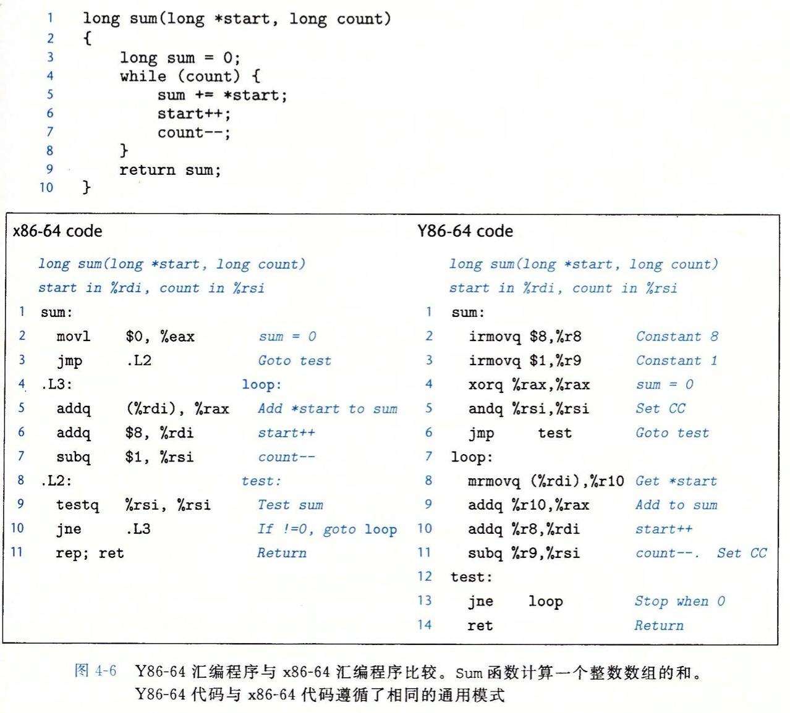

### 第四章 处理器体系结构

#### Y86-64 指令集

##### 程序员可见的状态

* Y86-64 程序中的每条指令都会读取或修改处理器状态的某些部分。这称为程序员可见状态，这里的程序员既可以是汇编代码写程序的人，也可以是机器级代码的编译器
* Y86-64 的状态类似于 x86-64
  * 有 15 个寄存器：%rax，%rbx，%rsp，%rbp，%rsi，%rdi 和 %r8 到 %r14
  * 每个寄存器储存一个 64 位的字
  * 寄存器 %rsp 被入栈，出栈，调用和返回指令作为栈指针，除此之外寄存器没有固定的含义和固定的值
  * 有三个一位的条件码：ZF，SF 和 OF，它们保存着最近的算数或逻辑指令所造成影响的相关信息
  * 程序计数器（PC）存放当前正在被执行指令的地址
  * Y86-64 程序用虚拟地址来引用内存位置，硬件和操作系统软件联合起来将虚拟地址翻译成实际或物理地址，指明数据实际存在内存的哪个地方
  * 程序状态最后一个部分是 Stat，它表明程序执行的总体状态。它会指示是正常运行，还是出现了某种异常

##### Y86-64 指令

* Y86-64 指令集基本上是 x86-64 指令集的一个子集，它只包括 8 字节整数操作，寻址方式较少，操作也较少，因为只有 8 字节数据，所以称之为 **字**不会有任何歧义
* x86-64 的 movq 指令分成了 4 个不同的指令（irmovq，rrmovq，mrmovq 和 rmmovq），分别显式的指明源和目的的格式。源可以是 立即数（i），寄存器（r）或内存（m），指令的第一个字母表明源的类型，目的可以是寄存器或内存，第二个字母表明了目的的类型
* Y86-64 和 x86-64 一样，不允许从一个内存地址直接传送到另一个内存地址，也不允许将立即数传入内存
* Y86-64 有 4 个整数指令操作：addq，subq，andq 和 xorq，它们只对寄存器数据进行操作，而 x86-64还允许对内存数据进行这些操作
* Y86-64 有 7 个调整指令 jmp，jle，jl，je，jne，jge 和 jg
* Y86-64 有 6 个条件传送指令 cmovle，cmovl，cmove，cmovne，cmovge，和 cmovg，这些指令的格式与寄存器 -- 寄存器传送指令 rrmovq 一样，但是只有当条件码满足所需要的约束时，才会更新目的寄存器的值
* call 指令将返回地址入栈，然后跳到目的地址。ret 指令从这样的调用中返回
* pushq 和 popq 指令与 x86-64 一样，实现了入栈和出栈
* halt 指令停止指令的执行。在 x86-64 中有一个与之相当的指令 hlt，x86-64 的应用程序不允许使用这条指令，因为它会导致整个系统暂停允许

##### 指令编码

* 每条指令需要 1 ~ 10 个字节不等，这取决于哪些字段。
* 每条指令的第一个字节表明指令类型，这个字节分为两个部分，每部分 4 位：高 4 位是代码部分，低 4 位是功能部分

* 15 个寄存器中每个都有一个相对应的范围在 0 到 0xE 之间寄存器标识符，Y86-64 与 x86-64 的寄存器编号一样。
* 程序寄存器存在 CPU 中的一个寄存器文件中，这个寄存器就是一个小的，以寄存器 ID 作为地址的随机访问储存器，当指令编码中以及我们的硬件设计中，当需要指明不应访问任何寄存器时，就用 0xF 来表示
* 有些指令需要一个附加的 4 字节常数。这个字能作为 irmovq 的立即数据，rmmovq 和 mrmovq 的指令指示符偏移量，以及分支指令和调用指令的目的地址 **这里的分支指令和调用指令的目的是一个绝对地址，而不像 IA32 中那样使用 PC 相对寻址的方式**

##### Y86-64 异常

* 状态码 Stat，它描述程序执行的总体状态。
  * AOK：代码值为 1，表示程序正常执行
  * HLT： 代码值为 2，表示处理器执行了一条 halt 指令
  * ADR：代码值为 3，表示处理器试图从一个非法内存地址读取或者向一个非法内存地址写，可能是当取指令的时候，也可能是当读数据的时候，我们会限制最大的地址，任何访问超过这个限定值都将引发 ADR 异常
  * INS： 代码值为 4，表示遇到了非法指令的代码
* 对于 Y86-64 ，当遇到这些异常的时候，会让处理器停止执行指令。在更完整的设计中，处理器通常会调用一个异常处理程序

#####  Y86-64 程序

* 比较  Y86-64  和 x86-64 的差异

##### 一些 Y86-84 指令的详情

* push 指令会把栈指针减 8 ，并且将一个寄存器写入内存中，因此，当执行 pushq %rsp 指令时，处理器的行为是不确定的，因为要入栈的寄存器会被同一条指令修改，通常由两种不同的约定：1）压入%rsp 的原始值，2）压入减去 8 的 %rsp的值

#### 逻辑设计和硬件控制语言 HCL

##### 逻辑门

* 逻辑门是数字电路的基本计算单元，它们产生输出，等于它们输入位值的某个布尔函数

* 逻辑门只对单个运算符进行操作，而不是整个数字
* AND ：&&，OR：||，NOT：！

##### 组合电路和 HCL 表达式

* 将很多的逻辑门组成一个网，就能构建计算模块，称为组合电路，如何构建这些网有几个限制
  * 每个逻辑门的输入必须连接到下述选项之一：
    * 1）一个系统输入（称为主输入）
    * 2）某个储存器单元的输出
    * 3）某个逻辑门的输出
  * 两个或多个逻辑门的输出不能连接在一起，否则它们可能使线上的信号矛盾，可能会导致一个不合法的电压或电路故障
  * 这个网必须是无坏的。也就是在网中不能有路径经过一系列门而形成一个回路，这样的回路会导致该网络计算的函数有歧义
  * HCL 和 C 语言中逻辑表达式的相似之处就是都用布尔操作来对输入函数进行计算，但它们还有以下区别
    * 因为组合电路是一系列的逻辑门，它的属性是输出会持续响应输入的变化，如果电路的输入变化了，在一定延迟后，输出也会响应的变化
    * C 的逻辑表达式运行参数是任意整数，0 表示 FALSE，其他的任何值都表示 TRUE，而逻辑门只对 0 和 1 进行操作
    * C 的逻辑表达式有个属性是他们可能只被部分求值，如果一个 AND 或 OR 操作的结果只用第一个参数求值就能确定，而逻辑门只是简单的响应输出的变化

##### 字级的组合电路和 HCL 整数表达式

* 在 HCL 中，我们将所有字级的信号都声明为 int，不指定字的大小。这样做是为了简单，在全功能的硬件描述语言中，每个字都可以声明为特定的位数，HCL 运行比较字是否相等 比如：bool Eq = （A == B），这里 A 和 B 是 int 类型的
* 与 C 的 switch 语句不同，HCL 不要求不通的选择表达式之间互斥，从逻辑上讲这些表达式是顺序求值的，且第一个求值为 1 的情况会被选中

#### 集合关系

##### 储存器和时钟

* 组合电路从本质上讲，不储存任何信息。相反，它们只是简单的响应输入信号，产生等于输入的某个函数的输出。为了产生时序电路，也就是有状态并且在这个状态上进行计算的系统，我们引入了**按位储存的设备**，储存设备都是由同一个时钟控制的，时钟是一个周期性信号，决定了什么时候要把新值加载到设备中
  * 时钟寄存器（简称寄存器） 储存单个位或字，时钟信号控制寄存器加载输入值
  * 随机访问存储器（检测内存）储存多个字，用地址来选择该读或该写哪个字

#### Y86-64 的顺序实现

##### 将处理组织成阶段

* 通常处理一条指令包括很多操作。将它们组织成某个特殊的阶段序列，即使指令的动作差异很大，但所有的指令都遵循统一的序列，每一步具体处理取决于正在执行的指令。创建一个这样的框架，我们就能够设计一个充分利用硬件的处理器，下面是关于各个阶段以及各个阶段内执行操作的简略描述
  * 取指：从内存中读取指令字节，地址为程序计数器（PC）的值，它可能取出一个寄存器指示符字节，指明一个或两个寄存器操作数指示符 rA 和 rB。它还可能取出一个四字节常数字 valC，它按顺序方式计算当前指令的下一条指令 valP，也就是说 valP 等于 PC 的值加上已取出指令的长度
  * 译码：译码阶段从结存器文件读入最多两个操作数，得到值 valA 和/或 valB。
  * 执行：在执行阶段，算术/逻辑单元执行指令指明的操作 或 增加/减少栈指针
  * 仿存：仿存阶段可以将数据写入内存，或者从内存读取数据
  * 写回：写回阶段最多可以写两个结果到寄存器文件
  * 更新PC：将 PC 设置成下一条指令的地址