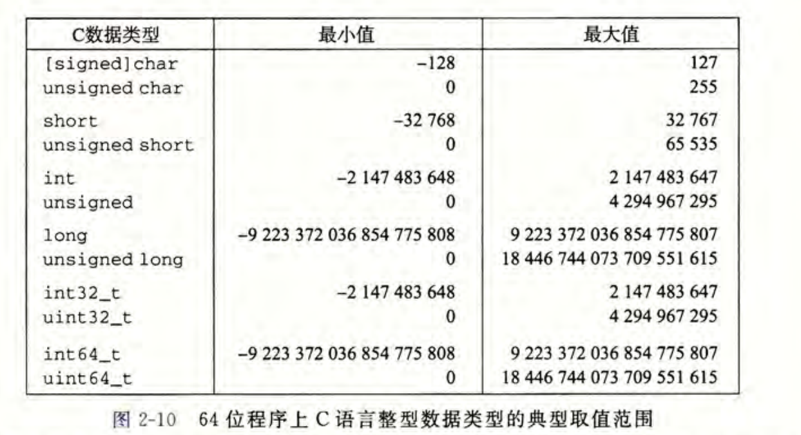

C和 C++ 都支持有符号（默认）和无符号数。Java 只支持有符号数。

整数运算和浮点数运算会有不同的数学属性是因为它们处理数字表示有限性的方式不同，整数的表示虽然只能编码一个相对较小的数值范围，但是这种表示是精确的，而浮点数虽然可以编码一个较大的数值范围，但是这种表示只是近似的。(是的，关于字符串转浮点数再计算比较恶心，在sql中ROUND('4.55',1)是4.5...而ROUND(4.55)是4.6 TODO:找原因)

8位(bit)为一个字节(byte)，作为最小的可寻址内存单位

每台计算机都有一个字长（word size), 指明指针数据的标称大小(nominal size)。

**整数**

用位来编码整数的两种不同的方式：一种只能表示非负数，而另一种能够表示负数、零和正数。

32位和64位的整型取值范围，就long和unsigned long不同。

64位long和int 64_t、32位int64_t取值范围相同。

**浮点数**

**理解进制转换**

**字节序（大小端）**

某些机器选择在内存中按照从最低有效字节到最高有效字节的顺序存储对象，最低有效字节在最前面------------**小端法**

一些机器则按照从最高有效字节到最低有效字节的顺序存储，最高有效字节在最前面------------**大端法**

**位运算**

它支持按位布尔运算，确定一个位级表达式的结果最好的方法，就是将十六进制的参数扩展成二进制表示并执行二进制运算，然后再转换回十六进制。

补码运算

**移位运算**

左移：丢弃高位，右端补0

右移：分为逻辑右移和算术右移。逻辑右移：左端补0.算术右移：左端补最高位的有效位值。

**数据精度**