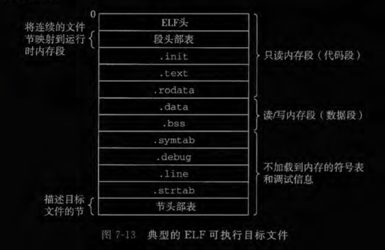

# 					**《深入理解计算机系统》**

​	前期耽误时间太多，勉强把书籍看完，笔记补到第七章。

## 第一章 计算机漫游

### 1.1信息就是位+上下文

**个人理解**：位来相当于作文当中的字，上下文相当于语境，把这些字根据语境组合起来，形成不同的意思。

### 1.2 从源文件到目标文件的转化过程

GCC 编译器驱动程序：

**预处理器**：通过“#”，来识别头文件，并插入到程序中。

**编译器**：*翻译*成汇编语言。编译问题是否是该阶段产生的？毕竟是翻译成，而不是生成？

**汇编器**：翻译成机器语言指令。同上，这种翻译是否也会出现问题？

**连接器**：就是把调用C库中的函数与自己写的函数合并起来。

### 1.3编译系统学习的益处：

1、优化程序性能。

2、理解链接时出现的错误。

3、避免安全漏洞。

### 1.4程序和硬件的关系

**总线**：它携带信息字节并负责在各个部件间传递，是一组电子管道。它被设计成传送<u>定长</u>的字节块。

**I/O设备**：系统与外部联系的通道。通过控制器或适配器与I/O总线连接。

**主存**：临时存储设备。用来存放程序和程序处理的数据。

**处理器**：CPU,解释（或执行）存储在主存中指令的引擎。

### **1.5高速存储**

​		存放处理器近期可能会需要的信息。因为存储小，所以速度快，加快程序在启动到运行期间的赋值操作。

*意识到高速缓存存储器存在的应用程序员能够利用高速缓存将程序的性能提高一个数量级。*

### 1.6存储设备形成层次结构

​		在处理器和一个较大较慢的设备（例如主存）之间插入一个更小更快的存储设备（例如高速缓存）。

​		更小，更快，更贵，处于金字塔上层。

**疑问**：又多了一个存储设备，存储器层次结构越深，不应该更耗时吗(**Todo**：看完第六章再回来看该问题)  后期理解：还有成本的因素在里面

### 1.7 操作系统管理硬件

​		操作系统有两个基本功能：（1)防止硬件被失控的应用程序滥用；（2)向应用程序提供简单一致的机制来控制复杂而又通常大不相同的低级硬件设备。

​		这一小节提到了，进程，线程和虚拟内存、文件的概念。

## 第 2 章 信息的表示和处理

1、C和 C++ 都支持有符号（默认）和无符号数。Java 只支持有符号数。

2、大多数计算机使用8 位(bit)的块，或者字节（byte), 作为最小的可寻址的内存单位。

3、整数运算和浮点数运算会有不同的数学属性是因为它们处理数字表示有限性的方式不同，整数的表示虽然只能编码一个相对较小的数值范围，但是这种表示是精确的，而浮点数虽然可以编码一个较大的数值范围，但是这种表示只是近似的。(关于字符串转浮点数再计算比较恶心，在sql中ROUND('4.55',1)是4.5...而ROUND(4.55)是4.6 **TODO**:找原因)

**整数**

用位来编码整数的两种不同的方式：一种只能表示非负数，而另一种能够表示负数、零和正数。

32位和64位的整型取值范围，就long和unsigned long不同。

64位long和int 64_t、32位int64_t取值范围相同。

**字节序（大小端）**

某些机器选择在内存中按照从最低有效字节到最高有效字节的顺序存储对象，最低有效字节在最前面------------**小端法**

一些机器则按照从最高有效字节到最低有效字节的顺序存储，最高有效字节在最前面------------**大端法**

**位运算**

它支持按位布尔运算，确定一个位级表达式的结果最好的方法，就是将十六进制的参数扩展成二进制表示并执行二进制运算，然后再转换回十六进制。

**移位运算**

左移：丢弃高位，右端补0

右移：分为逻辑右移和算术右移。逻辑右移：左端补0.算术右移：左端补最高位的有效位值。

## 第5章 优化程序性能

这一章跳读有点多，没咋理解，后期再来补。

### 5.9 提高并行性

循环展开和并行地累积在多个值中，是提高程序性能的更可靠的方法。

### 5.10 优化合并代码的结果小结

使用多项优化技术，我们获得的 CPE 已经接近于 0.50 和 1.00 的吞吐量界限，只受限于功能单元的容量。与原始代码相比提升了 10-20倍，且使用普通的 C 代码和标准编译器就获得了所有这些改进。重写代码利用较新的 SIMD指令得到了将近 4 倍或 8 倍的性能提升。比如单精度乘法，CPE 从初值 11.14 降到了 0.06, 整体性能提升超过 180 倍。 这个例子说明现代处理器具有相当的计算能力，但是我们可能需要按非常程式化的方式来 编写程序以便将这些能力诱发出来。

### 5.11 —些限制因素

1、寄存器溢出：并行度p超过了可用的寄存器数量,会溢出，并将某些临时值存在内存中，通常在运行时的堆栈上。

2、分支预测和预测错误处罚：1). 不要过分关心可预测的分支；2).书写适合用条件传送实现的代码

## 第 6 章 存储器层次结构

这一章帮我很好理解了第二章不懂得地方。一个系统，不仅要考虑性能，还需要考虑成本。

### 6.3 存储器层次结构

一图胜千言

高速缓存，是一个小而快速的存储设备，它作为存储在更大、也更慢的设备中的数据对象的缓冲区域。，层次结构中的每一层的缓存(k+1)来自较低一层(k)的数据对象。CPU 寄存器组是最小的缓存。

取缓存数据时，有缓存命中和不命中之分。

1. **缓存命中**：在k+1层取数据对象d时，如果d 刚好缓存在第k层中，那么就是缓存命中。这样要比k+1层读取d要快。
2. **缓存不命中**：如果第k层中没有缓存数据对象,就是缓存不命中。第 k 层的缓存从第4+1层缓存中取出包含d的那个块，如果第k层的缓存已经满了,可能就会覆盖现存的一个块。
3. **缓存不命中的种类**：1).强制性不命中或冷不命中;2).冲突不命中;
4.  **缓存管理**:管理缓存的逻辑可以是硬件、软件，或是两者的结合。在每一层上，某种形式的逻辑必须管理缓存，将缓存划分成块，在不同的层之间传送块，判定是命中还是不命中，并处理它们。

### 6.4 高速缓存存储器

### 

**通用的高速缓存存储器组织结构**：一般而言，高速缓存的结构可以用元组（S, E，B，m)来描述。一个计算机系统，其中每个存储器地址有m位，形成 M=2^m^个不同的地址。这样一个机器的高速缓存被组织成一个有S=2^s^个高速缓存组。每个组包含E个高速缓存行。每个行是由一个 B = 2^b^字节的数据块组成的，一个有效位指明这个行是否包含有意义的信息，还有 t= m-(b+s)个标记位(是当前块的内存地址的位的一个子集), 它们唯一地标识存储在 这个高速缓存行中的块。

**直接映射高速缓存：**据每个组的高速缓存行数 E，高速缓存被分为不同的类。每个组只有一行(E=1)的高速缓存。

**组相联高速缓存:**放松了像直接映射高速缓存中冲突不命中造成的问题源于每个组只有一行的限制，所以每个组都保存有多于一个的高速缓存行。

**全相联高速缓存：**由一个包含所有高速缓存行的组（即 E=C/B)。

**衡量高速缓存的性能:**1、不命中率；2、命中率；3、命中时间；4、不命中处罚。

### 6.5 编写高速缓存友好的代码

todo：p476,看例子。

1) 让最常见的情况运行得快。

2) 尽量减小每个循环内部的缓存不命中数量。

## 第 7 章  链 接

这一章需要再看一遍，细细揣摩，结合虚拟内存。

*<u>链接(linking)是将各种代码和数据片段收集并组合成为一个单一文件的过程，这个文件可被加载（复制）到内存并执行。</u>*

1、链接可以执行于编，译时 (compile time)，也就是在源代码被翻译成机器代码时；

2、链接也可以执行于加栽时（load time)，也就是在程序被加载器（loader)加载到内存并执行时；

3、执行于运行时（runtime)，也就是由应用程序来执行。

在早期的计算机系统中，链接是手动执行的。在现代系统中，链接是由叫做链接器（linker)的 程序自动执行的。

### 7.1 编译器驱动程序

用户在需要时调用语言预处理器、编译器、汇编器和链接器。

驱动程序在将示例程序从ASCII 码源文件翻译成可执行目标文件时的行为,如下：

shell 调用操作系统中一个叫做加载器（loader)的函数，它将可执行文件 prog 中的代码和数据**复制到内存**，然后**将控制转移到这个程序的开头。**

### 7.2 静态链接

像 Linux LD 程序这样的静态链接器（static linker)<u>以一组**可重定位目标文件和命令行参数**作为输入</u>，生成一个<u>完全链接</u>的、<u>可以加载和运行</u>的<u>可执行目标文件</u>作为输出。

为了构造可执行文件，链接器必须完成两个主要任务：

**1、符号解析(symbol resolution)：**目标文件定义和引用符号，每个符号对应于一个函数、一个全局变量或一个静态变量，符号解析的目的是将每个符号引用正好和一个符号定义关联起来。

**2、重定位（relocation)**：编译器和汇编器生成从地址 0 开始的代码和数据节。链接器通 过把每个符号定义与一个内存位置关联起来，从而重定位这些节，然后修改所有对 这些符号的引用，使得它们指向这个内存位置。链接器使用汇编器产生的重定位条 目（relocation entry)的详细指令，不加甄别地执行这样的重定位。

目标文件纯粹是字节块的集合。这些块中，有些包含程序代码，有些包含程序数据，而其他的则包含引导链接器和加载器的数据结构。链接器将这些块连接起来，确 定被连接块的运行时位置，并且修改代码和数据块中的各种位置。链接器对目标机器了解甚少。产生目标文件的编译器和汇编器已经完成了大部分工作。

### 7.3 目标文件

目标文件的三种形式：

**1、可重定位目标文件**：包含二进制代码和数据，其形式可以在编译时与其他可重定位目标文件合并起来，创建一个可执行目标文件。

**2、可执行目标文件**：包含二进制代码和数据，其形式可以被直接复制到内存并执行。

**3、共享目标文件**：一种特殊类型的可重定位目标文件，可以在加载或者运行时被动态地加载进内存并链接。

编译器和汇编器生成可重定位目标文件(包括共享目标文件）。链接器生成可执行目标文件。从技术上来说，一个目标模块(object module)就是一个字节序列，而一个目标文件(object file)就是一个以文件形式存放在磁盘中的目标模块。

各系统目标格式不同，Unix：可执行文件a.out；Windows:可移植可执行PE；Mac OS-X 使用 Mach-0格式；现代 x86-64 Linux 和 Unix 系统使用可执行可链接格式ELF。

### 7.4 可重定位目标文件

**ELF 头**（ELF header)以一个 <u>16 字节的序列开始</u>，这个序列<u>描述了生成该文件的系统的字的大小和字节顺序</u>。

ELF 头剩下的部分包含帮助链接器语法分析和解释目标文件的信息，包括：

1、ELF 头的大小；

2、目标文件的类型（如可重定 位、可执行或者共享的）；

3、机器类型（如 X86-64)；

4、节 头部表（section header table)的文件偏移；

5、节头部表中条目的大小和数量。

**节头部表**是来<u>描述不同节的位置和大小</u>的，其中目标文件中每个节都有一个固 定大小的条目（entry)。

夹在 ELF头和节头部表之间的都是**节**，典型的ELF包含下面几个节(如上图)：

**.text**: 已编译程序的机器代码。

**.rodata**:只读数据，比如printf 语句中的格式串和开关语句的跳转表。

**.data**:已初始化的全局和静态 C 变量。<u>局部 C 变量在运行时被保存在栈中，既不出现在.data 节中，也不出现在.bss 节中</u>。

**.bss**: 未初始化的全局和静态 C 变量，以及所有被初始化为 0 的全局或静态变量。在目标文件中<u>这个节不占据实际的空间</u>，它仅仅是一个<u>占位符</u>。目标文件格式区分已初始化 和未初始化变量是<u>为了空间效率</u>：在目标文件中，未初始化变量不需要占据任何实际的磁盘空间。<u>运行时，在内存中分配这些变量</u>，初始值为 0。

**.symtab**: —个符号表，它存放在程序中定义和引用的函数和全局变量的信息，和编译器中的符号表不同，.symtab符号表不包含局部变量的条目。

**.rel.text**:—个.text 节中位置的列表，当链接器把<u>这个目标文件和其他文件组合时</u>，<u>需要修改这些位置</u>。一般来说，任何<u>调用外部函数或者引用全局变量的指令</u>，则需要修改。调用本地函数的指令则不需要修改。可执行目标文件中并不需要重定位信息，因此通常省略，除非用户显式地指示链接器包含这些信息。

**.rel.data**:被模块引用或定义的所有全局变量的<u>重定位信息</u>。一般而言，任何已初始化的全局变量，如果它的初始值是一个全局变量地址或者外部定义函数的地址，都需要 被修改。

**.debug**:一个调试符号表，其条目是程序中定义的局部变量和类型定义，程序中定 义和引用的全局变量，以及原始的 C 源文件。只有以-g 选项调用编译器驱动程序时，才会得到这张表。

**.line**: 原始 C 源程序中的行号和.text 节中机器指令之间的映射。只有以-g 选项调用编译器驱动程序时，才会得到这张表。

**.strtab**: —个字符串表，其<u>内容包括.symtab 和.debug 节中的符号表</u>，以及节头部中的令名字。字符串表就是以 null 结尾的字符串的序列。

### 7.5 符号和符号表

每个可重定位目标模块 m 都有一个符号表，它包含 m 定义和引用的符号的信息,链接器上下文中，有三种不同符号：

1、由模块 m 定义并能被其他模块引用的全局符号。全局链接器符号对应于非静态的C函数和全局变量。

2、由其他模块定义并被模块 m 引用的全局符号。这些符号称为外部符号，对应于在其他模块中定义的非静态 C 函数和全局变量。

3、只被模块肌定义和引用的局部符号。它们对应于带 static属性的 C 函数和全局变 量。这些符号在模块 m 中任何位置都可见，但是不能被其他模块引用。

C 程序员使用 static 属性隐藏模块内部的变量和函数声明，和Java中public和private声明一样。

### 7.6 符号解析

将每个引用与它输入的可重定位目标文件的符号表中的一个确定的符号定义关联起来。

**静态库**（static library)：编译系统将所有相关的目标模块打包成为一个单独的文件，它可以用做链接器的输人。

### 7.7 重定位

重定位由两步组成：

1、**重定位节和符号定义**。链接器将所有相同类型的节合并为同一类型的新的聚合节。

2、**重定位节中的符号引用**。链接器修改代码节和数据节中对每个符号的引用，使得它们指向正确的运行时地址。这一步依赖**重定位条目**的数据结构。

**重定位条目**：代码的重定位条目放在.rel.text 中，已初始化数据的重定位条目放在.rel.data中。目的是告诉链接器在将目标文件合并成可执行文件时如何修改这个引用。

### 7.8 可执行目标文件

可执行目标文件的格式<u>类似于可重定位目标文件的格式</u>。**ELF 头**描述文件的<u>总体格式</u>。它还包括程序的入口点（entry point), 也就是当程序运行时要执行的第一条指令的地 址。**.text.rodata 和.data**节与可重定位目标文件中的节是相似的，除了这些节已经被 重定位到它们最终的运行时内存地址以外。**.init 节**定义了一个小函数，叫做_init 程序的初始化代码会调用它。因为可执行文件是完全链接的（已被重定位），所以它不再需要. rel 节。

ELF 可执行文件被设计得很容易加载到内存，可执行文件的连续的片（chunk)被映射到连续的内存段。程序头部表（program header table)描述了这种映射关系

### 7.9 加载可执行目标文件

### 7.10 动态链接共享库

共享库是一个目标模块，在运行或加载时，可以加载到任意的内存地址，并和一个在内存中的程序链接起来,这个过程称为**动态链接**(dynamic linking)是由**动态链接器**（dynamic linker) 的程序来执行的。共享库也称为共享目标（shared object),Linux通常用.so后缀,Windows是dll。

### 7.12 位置无关代码

### 7.13 库打桩机制

它允许程序员截获对共享库函数的调用，取而代之执行自己的代码。基本思想是：

1、给定一个需要打桩的目标函数。

2、创建一个包装函数，它的原型与目标函数完全一样。

打桩可以发生在编译时、链接时或当程序被加载和执行的运行时。