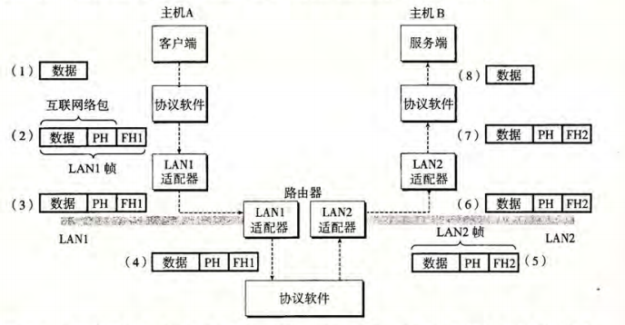
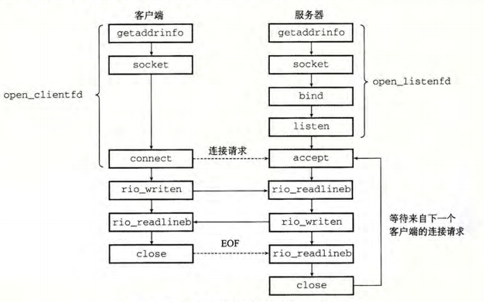

网络编程主要是解决两个进程间通过网络通信
### 11.2 网络
对主机而言，网络只是又一种 I/O设备，是数据源和数据接收方。  
从网络上接收到的数据，从适配器经过I/O和内存总线复制到内存，通常经过DMA传送。

最流行的局域网技术是以太网。    
一个以太网段包括一些电缆和集线器。  电缆一端连接集线器一端连接适配器，集线器不加分辨地将一个端口上收到的每个位复制到其它所有端口上。一台主机可以发送一段位(称为帧（frame))到这个网段内的其他任何主机。  

集线器与集线器之间使用以太网桥来连接。  

多个不兼容的局域网可以通过叫做路由器（router)的特殊计算
机连接起来，组成一个 internet(互联网络）  

路由器可以用来由各种局域网和广域网构建互联网络。


下图是复制数据从一台主机到另外一台主机



### 11.3 全球 IP 因特网
#### 11.3.1 IP 地址
ip地址是32位无符号整数

```
/*IP address structure */
struct in_addr {
uint32_t s_addr; /* Address in network byte order (big-endian) */
}
```

因特网主机可以有不同的主机字节顺序，TCP/IP 为任意整数数据项定义了统一的
网络字节顺序(network byte order)(大端字节顺序）（大部分主机是小端，TCP/IP一定是大端存储）


在网络和主机字节顺序间实现转换相关函数：

```
uint32_t htol(uint32 hostlong);
uintl6_t htons(uintl6_t hostshort);返回：按照网络字节顺序的值。  

uint32_t ntohl(uint32-t netlong);
uintl6_t ntohs(unitl6_t netshort);返回：按照主机字节顺序的值。
```
IP地址和点分十进制之间转换

```
#include <arpa/inet.h>
int inet_pton(AF_INET, const chax *src, void *dst);
返回：若成功则为 1，若 src 为非法点分十进制地址则为 0, 若出错则为一1。  

const char *inet_ntop(AF_INET, const void *src, char *dst,socklen_t size);
返回：若成功则指向点分十进制字符串的指针，若出错则为 NULL
```
n:代表网络 p：代表本机

#### 11.3.2 因特网域名
因特网客户端和服务器互相通信时使用的是 IP 地址。后来又发明了易于记住的DNS与ip地址配对。
查找本机ip地址可以使用  `nslookup`

#### 11.3.3 因特网连接
因特网客户端和服务器通过在连接上发送和接收字节流来通信。从连接一对进程的意
义上而言，连接是点对点的。从数据可以同时双向流动的角度来说，它是全双工的。并且
从(除了一些如粗心的耕锄机操作员切断了电缆引起灾难性的失败以外）由源进程发出的字
节流最终被目的进程以它发出的顺序收到它的角度来说，它也是可靠的。

### 11.4 套接字接口



#### 11.4.1 套接字地址结构
```
/* IP socket address structure */
    /* $begin sockaddr */
    /* IP socket address structure */
    struct sockaddr_in  {
        uint16_t        sin_family;  /* Protocol family (always AF_INET) */
        uint16_t        sin_port;    /* Port number in network byte order */
        struct in_addr  sin_addr;    /* IP address in network byte order */
        unsigned char   sin_zero[8]; /* Pad to sizeof(struct sockaddr) */
    };

    /* Generic socket address structure (for connect, bind, and accept) */
    struct sockaddr {
        uint16_t  sa_family;    /* Protocol family */
        char      sa_data[14];  /* Address data  */
    };	
    /* $end sockaddr */
```
_in后缀是internet的缩写。

#### 11. 4. 2 socket 函数

```
int socket(int domain, int type, int protocol);返回：若成功则为非负 描述符，若出错则为-1
```
#### 11. 4. 3 connect 函数

```
int connect(int clientfd, const struct sockaddr *addr,socklen_t addrlen);
返回：若成功则为 0, 若出错则为 一1。
```
####  11.4. 4 bind 函数

```
int bind(int sockfd, const struct sockaddr *addr,socklen_t addrlen);
返回：若成功则为 0, 若出错则为 一1。
```

#### 11.4. 5 listen 函数

```
int listen(int sockfd, int backlog);
返回：若成功则为 0, 若出错则为一1。
```
#### 11.4. 6 accept 函数

```
int accept(int listenfd, struct sockaddr *addr, int *addrlen);
返回：若成功则为非 负连接描述符，若出错则为一1。
```
监听描述符和已连接描述符之间的区别：
- 监听描述符用来监听客户端连接请求，一旦请求到达直接fork子进程
- 已连接描述符是用来与客户端进行通信的
- 
#### 11.4.7 主机和服务的转换

```
#include <sys/types.h>
#include <sys/socket.h>
#include <netdb.h>
int getaddrinfo(const char *host, const char,const struct addrinfo *hints,struct addrinfo **result);  
返回：如果成功则为 0，如果错误则 为非零的错误代码。
void freeaddrinfo(struct addrinfo *result);  
返回：无。
const char *gai_strerror(int errcode);
返回：错误消息。
```

**这个数据结构非常重要**
```
/* $begin addrinfo */
struct addrinfo {
    int              ai_flags;     /* Hints argument flags */
    int              ai_family;    /* First arg to socket function */
    int              ai_socktype;  /* Second arg to socket function */
    int              ai_protocol;  /* Third arg to socket function  */
    char            *ai_canonname; /* Canonical hostname */
    size_t           ai_addrlen;   /* Size of ai_addr struct */
    struct sockaddr *ai_addr;      /* Ptr to socket address structure */
    struct addrinfo *ai_next;      /* Ptr to next item in linked list */
};
/* $end addrinfo */
```
在编写进程通信的代码时，最后一定要close掉打开的文件描述符**虽然内核在进程关闭时，会自动关闭所有打开的描述符**，但是，如果进程没有及时被回收，一定会造成资源的浪费。 

### 11.5 Web 服务器
#### 11.5. 3 HTTP 事务
- HTTP 请求  
method URI version  
- HTTP 响应   
version status-code status-message

### 11.7小结
Web 服务器使用 HTTP 协议和它们的客户端（例如浏览器）彼此通信。浏览器向服务器请求静态或者
动态的内容。对静态内容的请求是通过从服务器磁盘取得文件并把它返回给客户端来服务的。对动态内
容的请求是通过在服务器上一个子进程的上下文中运行一个程序并将它的输出返回给客户端来服务的。  

cgi应用程序：提前写好的可执行程序，然后在子进程中execve它。