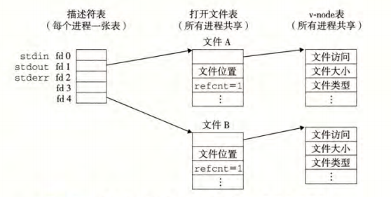

输入/输出（I/O)是在主存和外部设备(例如磁盘驱动器、终端和网络)之间复制数据的过
程。输人操作是从 I/O 设备复制数据到主存，而输出操作是从主存复制数据到 I/O 设备。  

在 Linux 系统中，是通过使用由**内核**提供的系统级 Unix I/O 函数来实现这些较高级别的 I/O 函数的。  
学习unix I/O的作用
- 了解其他系统的概念。  
I/O 在进程的创建和
执行中扮演着关键的角色。反过来，进程创建又在不同进程间的文件共享中扮演着关
键角色。
- 有些地方只能使用系统IO  
标准 I/O 库没有提供读取文件元数据的方式，例如文件大小或文件创建时间

### 10. 1 Unix I/O
输入和输出有统一的路径：
- 打开文件 。一个应用程序通过要求内核打开相应的文件，来宣告它想要访问一个I/O 设备
- linux shell创建的每个进程开始时都有三个打开的文件。
标准输入(描述符为 0)、标准输出（描述符为 1)和标准错误（描述符为 2)。
- 改变当前的文件位置。应用程序通过使用seek显示设置当前文件位置k，默认为0.
- 读写文件。一个读操作就是从文件复制n>0 个字节到内存。当超过文件长度会出现EOF
- 关闭文件。当应用完成对文件的访问，就通知内核关闭这个文件。  
**无论进程因何种原因终止了，内核都会关闭所有打开的文件并释放他们的内存资源**


### 10.2 文件
每个linux文件都有一个类型：
- 普通文件
- 目录
- 套接字
- 命名管道
- 符号链接
- 字符
- 块设备
- 

### 10.3 打开和关闭文件

```
int open(char *filenname,int flags, modest mode);
返回：若成功则为新文件描述符，若出错为一1。
```
打开文件常见的几个flag：
- O_RD0NLY: 只读。
- O_WR0NLY: 只写。
- O_RDWR: 可读可写。
- O_CREAT: 如果文件不存在，就创建它的一个截断的（truncated)(空）文件。
- O_TRUNC: 如果文件已经存在，就截断它。
- O_APPEND: 在每次写操作前，设置文件位置到文件的结尾处。

mode参数（权限）  
每个进程都有一个umask。文件访问权限为mode & ~umask  


| 掩码    | 描述                               |
| ------- | ---------------------------------- |
| S_IRUSR | 使用者（拥有者）能够读这个文件     |
| S_IWUSR | 使用者（拥有者）能够写这个文件     |
| S_IXUSR | 使用者（拥有者）能够执行这个文件   |
| S_IRGRP | 拥有者所在组的成员能够读这个文件   |
| S_IWGRP | 拥有者所在组的成员能够写这个文件   |
| S_IXGRP | 拥有者所在组的成员能够执行这个文件 |
| S_IROTH | 其他人（任何人）能够读这个文件     |
| S_IWOTH | 其他人（任何人）能够写这个文件     |
| S_IXOTH | 其他人（任何人）能够执行这个文件   |


```
//关闭已经打开的文件描述符
int close(int fd);
```
**关闭一个已经关闭的文件描述符会报错**
### 10.4 读和写文件

```
ssize_t read(int fd, void *buf, size_t n); 
返回：若成功则 为读的 字节数，若 EOF 则为 0, 若出错为一U
ssize.t write(int fd, const void *buf, size_t n); 
返回：若成功则 为写的 字节数，若出错则为 一1。
```
read 函数从描述符为 fd 的当前文件位置复制最多 n 个字节到内存位置 buf
- 返回值-1表示一个错误
- 返回值 0 表示 EOF
- 返回值表示的是实际传送的字节数量。
- 
ssize_t与size_t有什么区别？
size_t被定义为unsigned long，而 ssize_t(有符号的 大小）被定义为 long。

有的时候read 和 write 传送的字节比应用程序要求的要少。不足值不表示有错误。
- 读时遇见eof。读取的字符已经不足要求的大小。
- 从终端读取文本行。返回的不足值是文本行的大小。
- 读和写网络套接字。缓冲区约束和网咯延迟会引起read和write返回不足值。
- 
### 10.6 读取文件元数据
调用 stat 和 fstat 函数，检索到关于文件的信息（有时也称为文件的元数据（metadata))

```
int stat(const char *filename, struct stat *buf);
int fstat(int fd, struct stat *buf);
返回：若成功则为 0，若出错则为 一1。
```
stat结构，在编程中文件操作经常用到

```
  struct stat {
    _dev_t st_dev;      /* Device */
    _ino_t st_ino;      /* inode */
    unsigned short st_mode;/* Protection and file type */
    short st_nlink;     /* Number of hard links */
    short st_uid;       /* User ID of*/
    short st_gid;       /* Group*/
    _dev_t st_rdev;     /* Device type (if inode device)*/
    _off_t st_size;     /* Total size, in bytes */
    time_t st_atime;    /* Time of last access*/
    time_t st_mtime;    /* Time of last modification*/
    time_t st_ctime;    /*Time of last change*/
  };
```
### 10.7 读取目录内容

```
//打开文件夹
DIR *opendir(const char *name) ;
返回：若成功，则为 处理的指针；若出错，则为 NULL
//读取目录项
struct dirent *readdir(DIR *dirp);
返回：若成功，则为指向下一个目 录项的指针；若没有更多的目录项或出错，则为 NULL

//目录项结构
struct dirent {
ino_t d_ino; /* inode number */
char d_name [256] ; /* Filename */
}
d_ino文件在磁盘中的位置，d_ino相当于磁盘某个块的标号
```
### 10.8 共享文件
linux系统中有许多不同的方式来共享 Linux 文件。
内核用是三个相关的数据结构来标识打开的文件
- 描述符表：用文件描述符来索引。每个进程都有它独立的文件描述符表。每个打开的描述符表项指向文件表中的一个表项。
- 文件表：打开文件的集合是由一张文件表来表示的.所有进程共享这张表.  每个文件表表项：当前文件位置、引用计数、以及指向v-node表项的指针。关闭一个描述符，计数器减一，当引用计数为0的时候，内核会删除该文件。
- v-node表：每个表项包含 stat 结构中的大多数信息，包括 st_mode 和 st_size 成员。




- **【图-典型的打开文件的内核数据结构。在这个示例中，
两个描述符引用不同的文件。没有共享】**

多个描述符也可以通过不同的文件表表项来引用同一个文件。   

比如一个文件打开两次得到不同的文件描述符。每个都有自己的文件位置。所以可以对不同文件描述符进行操作

父子进程共享数据  
如果父进程在fork前有打开的文件，则fork之后，子进程有父进程描述符的副本。父子进程共享打开文件表集合。如果内核想要删除文件表表项，父子进程必须关闭各自的文件描述符。

### 10.9 I/O 重定向
主要使用**dup2**函数，该函数非常重要

```
int dup2(int oldfd, int newfd);
返回：若成功则为 非负的描述符，若出错则为 一1。
```